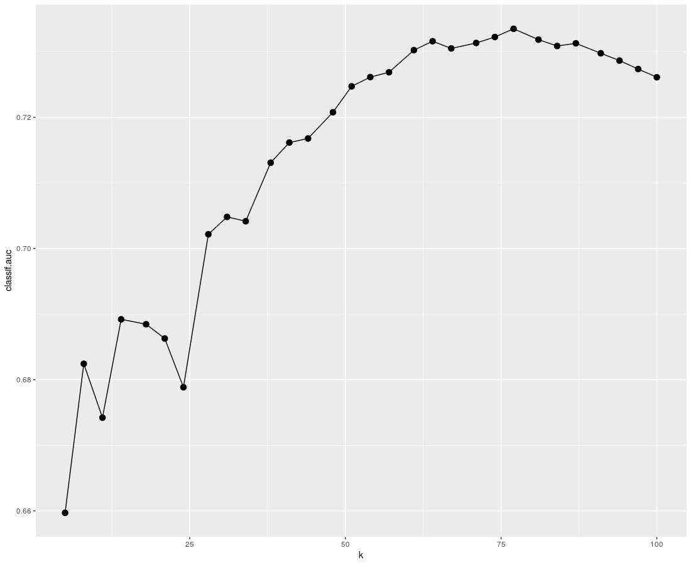
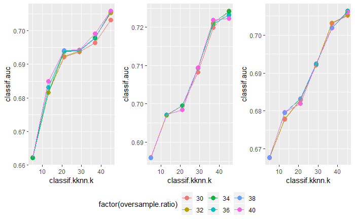

```{r setup, include=FALSE}
knitr::opts_chunk$set(echo = TRUE)
```

## KNN

KNN (k-nearest neighbors) is a method used for classification. In simple words, to classify one specific data point, it takes k neighbors with the shortest distance. Furthermore, based on how the neighbors are classified, we will assign the new input to the most popular category in the k neighbors. Here the number of k and the method of calculating the distances between data points are crucial. We will first evaluate how KNN performs between different data, including different encoding, and different missing value handling. Then we will explore different methods to get better results. This will be described in detail in the next section.

```{r eval=FALSE, message=FALSE, warning=FALSE}

library(mlr3)
library(mlr3learners)
library(mlr3tuning)
library(mlr3pipelines)
library(paradox)
library(tidyverse)
library(ggplot2)
library(gridExtra) # for merging plots in one

# suppress package making warning by start up in train 
# Warning: "package ‘kknn’ was built under R version 3.6.3"
suppressPackageStartupMessages(library(kknn))

setwd("C:/Users/user/Documents/R-projects/i2ml_final_project")

# read data with different encoding
dl_iv_data <- read.csv2("credit_card_prediction/iv_data/dl_iv_data.csv") %>% mutate(y = as.factor(y))
mf_iv_data <- read.csv2("credit_card_prediction/iv_data/mf_iv_data.csv") %>% mutate(y = as.factor(y))
mice_iv_data <- read.csv2("credit_card_prediction/iv_data/mice_iv_data.csv") %>% mutate(y = as.factor(y))

dl_oh_data <- read.csv("credit_card_prediction/oh_data/dl_oh_data.csv") %>% mutate(y = as.factor(y))
mf_oh_data <- read.csv("credit_card_prediction/oh_data/mf_oh_data.csv") %>% mutate(y = as.factor(y))
mice_oh_data <- read.csv("credit_card_prediction/oh_data/mice_oh_data.csv") %>% mutate(y = as.factor(y))

# load data directly into tasks for further training
tasks <- list(
  TaskClassif$new("dl_iv", backend = dl_iv_data, target = "y"),
  TaskClassif$new("mf_iv", backend = mf_iv_data, target = "y"),
  TaskClassif$new("mice_iv", backend = mice_iv_data, target = "y"),
  TaskClassif$new("dl_oh", backend = dl_oh_data, target = "y"),
  TaskClassif$new("mf_oh", backend = mf_oh_data, target = "y"),
  TaskClassif$new("mice_oh", backend = mice_oh_data, target = "y")
)

# knn learner
# setting the tunning for parameters, and terminator
knn_learner <- lrn("classif.kknn", predict_type = "prob")
knn_param_set <- ParamSet$new(params = list(ParamInt$new("k", lower = 50, upper = 50)))
terms <- term("none")

# creat autotuner, using the inner sampling and tuning parameter with grid_search
inner_rsmp <- rsmp("cv", folds = 5L)
knn_auto <- AutoTuner$new(learner = knn_learner, resampling = inner_rsmp, 
                          measures = msr("classif.auc"), tune_ps = knn_param_set,
                          terminator = terms, tuner = tnr("grid_search"))

# use outer sampling (nested sampling)
outer_rsmp <- rsmp("cv", folds = 3L)
design = benchmark_grid(
  tasks = tasks,
  learners = knn_auto,
  resamplings = outer_rsmp
)

# set seed before training, 
# then runs the benchmark, and save the results 
set.seed(2020)
knn_bmr <- benchmark(design, store_models = TRUE)


# autoplot auc for all tasks (merged in one plot)
multiplot_roc <- function(models){
  type <- "roc"
  plots <- list()
  
  # remove x, y axis text, and only keep ticks.
  thm <- theme(axis.text.x = element_blank(), axis.text.y = element_blank())
  
  # For all tasks we do:
  # extract certain model from benchmarkResult
  # aggregates average AUC value over the model
  # plot the ROC curve with AUC value listed in the title
  
  model <- models$clone()$filter(task_ids = "dl_iv")
  auc <- round(model$aggregate(msr("classif.auc"))[[7]], 4)
  plots[[1]] <- autoplot(model, type = type) + ggtitle(paste("dl_iv:", auc)) + thm
  
  model <- models$clone()$filter(task_ids = "mf_iv")
  auc <- round(model$aggregate(msr("classif.auc"))[[7]], 4)
  plots[[2]] <- autoplot(model, type = type) + ggtitle(paste("mf_iv:", auc)) + thm
  
  model <- models$clone()$filter(task_ids = "mice_iv")
  auc <- round(model$aggregate(msr("classif.auc"))[[7]], 4)
  plots[[3]] <- autoplot(model, type = type) + ggtitle(paste("mice_iv:", auc)) + thm
  
  model <- models$clone()$filter(task_ids = "dl_oh")
  auc <- round(model$aggregate(msr("classif.auc"))[[7]], 4)
  plots[[4]] <- autoplot(model, type = type) + ggtitle(paste("dl_oh:", auc)) + thm
  
  model <- models$clone()$filter(task_ids = "mf_oh")
  auc <- round(model$aggregate(msr("classif.auc"))[[7]], 4)
  plots[[5]] <- autoplot(model, type = type) + ggtitle(paste("mf_oh:", auc)) + thm
  
  model <- models$clone()$filter(task_ids = "mice_oh")
  auc <- round(model$aggregate(msr("classif.auc"))[[7]], 4)
  plots[[6]] <- autoplot(model, type = type) + ggtitle(paste("mice_oh", auc)) + thm
  
  # merge all plots in one plot
  do.call("grid.arrange", plots)
}

multiplot_roc(knn_bmr)

```

```{r echo=FALSE}
knitr::include_graphics("images/1_dataComp_auc.png")
#print("hello")
```


From the ROC plots above, we can see that KNN performs with no significant difference between different encoding and missing data handling methods. Moreover, To reduce our computation cost, we decided to take the task with the highest AUC value in the step, being **dl_iv**. In the following sections, we will focus on the task **dl_iv**, and fine-tune the parameters.

# KNN parameters

The KNN package included in mlr3 has the following parameters: k (the number of neighbors considered), distance (Parameter of Minkowski distance), 
kernel (kernel functions used to weight the neighbors). In the following section we will first explore them separately, and then combine the knowledge to perform further fine tuning to improve the model.


# K

```{r eval=FALSE}

task <- TaskClassif$new("dl_iv", backend = dl_iv_data, target = "y")

# knn with 3 different paramSets, to analysis how to do further tuning
#knn_lrn <- lrn("classif.kknn", predict_type = "prob")

# only k
param_k <- ParamSet$new(params = list(ParamInt$new("k", lower = 5, upper = 100)))

# k vs. distance
param_k_dist <- ParamSet$new(params = list(ParamInt$new("k", lower = 20, upper = 100),
                                            ParamInt$new("distance", lower = 1, upper = 3)))

# k vs. kernel
kernel_type = c("rectangular", "triangular", "epanechnikov", "biweight", "triweight", "cos", "inv", "gaussian", "rank", "optimal")
param_k_kernel <- ParamSet$new(params = list(ParamInt$new("k", lower = 40, upper = 100),
                                             ParamFct$new("kernel", levels = kernel_type)))

# Autotuner
inner_rsmp <- rsmp("holdout")
measure = msr("classif.auc")

knn_auto_k <- AutoTuner$new(learner = knn_lrn, resampling = inner_rsmp, 
                           measures = measure, tune_ps = param_k,
                           terminator = term("none"), tuner = tnr("grid_search", resolution = 30))

knn_auto_dist <- AutoTuner$new(learner = knn_lrn, resampling = inner_rsmp, 
                          measures = measure, tune_ps = param_k_dist,
                          terminator = term("none"), tuner = tnr("grid_search", resolution = 10))

knn_auto_kern <- AutoTuner$new(learner = knn_lrn, resampling = inner_rsmp, 
                           measures = measure, tune_ps = param_k_kernel,
                           terminator = term("none"), tuner = tnr("grid_search", resolution = 10))

# benchmark
outer_rsmp <- rsmp("holdout")

design_k <- benchmark_grid(
  tasks = task,
  learners = knn_auto_k,
  resampling = outer_rsmp 
)

design_dist <- benchmark_grid(
  tasks = task,
  learners = knn_auto_dist,
  resampling = outer_rsmp
)

design_kern <- benchmark_grid(
  tasks = task,
  learners = knn_auto_kern,
  resampling = outer_rsmp
)

run_benchmark <- function(design){
  set.seed(2020)
  tic()
  bmr <- benchmark(design, store_models = TRUE)
  toc()
  run_benchmark <- bmr
}

bmr_k <- run_benchmark(design_k)
bmr_dist <- run_benchmark(design_dist)
bmr_kern <- run_benchmark(design_kern)

library(ggplot2)

k_path = bmr_k$data$learner[[1]]$archive("params")
knn_ggp1 = ggplot(k_path, aes(
  x = k,
  y = classif.auc)) +
  geom_point(size = 3) +
  geom_line()


```

```{r echo=FALSE}

knitr::include_graphics("images/2/k_vs_dist.png")
knitr::include_graphics("images/2/k_dist_kern.png")
#print("hello")
```

In the first plot, we see that AUC is the highest in the range of 50 to 80. We decided to focus our tunning for k between 40 to 100. Moreover, in the second plot, it is shown that distance=1 performs the best. This is understandable since we have categorical variables encoded into 0 and 1, the distance is at most 1. If we set the power of Minkowski distance higher, all other variables with more considerable distances would be magnified, while the encoded variable stays with maximum 1. ($1^1 = 1^2 = 1^3 = .. = 1^n$) The plot shows that these variables have a reasonable amount of saying. We should keep there influence to the model, by fixing our distance parameter to 1. In the third plot, we see that again the distance set as 1, performs the best in terms of using each kernel.

# Using smote to balance data


```{r eval=FALSE, message=FALSE, warning=FALSE}

sel_kernel = c("gaussian", "inv")
task <- TaskClassif$new("dl_iv", backend = dl_iv_data, target = "y")

# knn learner
knn_learner <- lrn("classif.kknn", predict_type = "prob", distance=1, kernel=sel_kernel[1])
po_smote = po("smote", dup_size = 6)
lrn_smote <- GraphLearner$new(po_smote %>>% knn_learner, predict_type = "prob")

# setting the tunning for parameters, and terminator
knn_param_set <- ParamSet$new(params = list(ParamInt$new("classif.kknn.k", lower = 5, upper = 45),
                                            ParamInt$new("smote.dup_size", lower = 1, upper = 3),
                                            ParamInt$new("smote.K", lower = 1, upper = 5)
                                            ))


knn_param_set$trafo = function(x, param_set) {
  x$smote.K = round(2^(x$smote.K))
  x
}

terms <- term("none")


# creat autotuner, using the inner sampling and tuning parameter with random search
inner_rsmp <- rsmp("cv",folds = 5L)
knn_auto <- AutoTuner$new(learner = lrn_smote, resampling = inner_rsmp, 
                               measures = msr("classif.auc"), tune_ps = knn_param_set,
                               terminator = terms, tuner = tnr("grid_search", resolution = 6))

# set outer_resampling, and creat a design with it
outer_rsmp <- rsmp("cv", folds = 3L)
design = benchmark_grid(
  tasks = task,
  learners = knn_auto,
  resamplings = outer_rsmp
)

# 14:08 -> 14:28, 14:34 ->
# set seed before traing, then run the benchmark
# save the results afterwards
set.seed(2020)
knn_bmr <- benchmark(design, store_models = TRUE)

library(ggplot2)
stune_path1 = knn_bmr$data$learner[[1]]$archive("params")
stune_gg1 = ggplot(stune_path1, aes(
  x = classif.kknn.k,
  y = classif.auc, col = factor(smote.K), shape = factor(smote.dup_size))) +
  geom_point(size = 4) + ylim(0.66, 0.72) +
  geom_line(size=1) #+ theme(legend.position = "none")

stune_path2 = knn_bmr$data$learner[[2]]$archive("params")
stune_gg2 = ggplot(stune_path2, aes(
  x = classif.kknn.k,
  y = classif.auc, col = factor(smote.K), shape = factor(smote.dup_size))) +
  geom_point(size = 4) + ylim(0.66, 0.72) +
  geom_line(size=1) #+ theme(legend.position = "none")

stune_path3 = knn_bmr$data$learner[[3]]$archive("params")
stune_gg3 = ggplot(stune_path3, aes(
  x = classif.kknn.k,
  y = classif.auc, col = factor(smote.K), shape = factor(smote.dup_size))) +
  geom_point(size = 4) + ylim(0.66, 0.72) +
  geom_line(size=1)

library(ggpubr)
ggarrange(stune_gg1, stune_gg2, stune_gg3, common.legend = TRUE, legend="bottom", nrow=1)

```

```{r echo=FALSE}
knitr::include_graphics("images/2_smote_auc.png")
#print("hello")
```

# oversampling

```{r eval=FALSE, message=FALSE, warning=FALSE}

knn_learner <- lrn("classif.kknn", predict_type = "prob")
# po_smote = po("smote", dup_size = 6)
po_over = po("classbalancing",
             id = "oversample", adjust = "minor",
             reference = "minor", shuffle = FALSE, ratio = 6)

lrn_over <- GraphLearner$new(po_over %>>% knn_learner, predict_type = "prob")

# setting the tunning for parameters, and terminator
knn_param_set <- ParamSet$new(list(ParamInt$new("classif.kknn.k", lower = 5, upper = 45), 
                            ParamDbl$new("oversample.ratio", lower = 30, upper = 40)))

terms <- term("none")


# creat autotuner, using the inner sampling and tuning parameter with random search
inner_rsmp <- rsmp("cv",folds = 5L)
knn_auto <- AutoTuner$new(learner = lrn_over, resampling = inner_rsmp, 
                          measures = msr("classif.auc"), tune_ps = knn_param_set,
                          terminator = terms, tuner = tnr("grid_search", resolution = 6))

# set outer_resampling, and creat a design with it
outer_rsmp <- rsmp("cv", folds = 3L)
design = benchmark_grid(
  tasks = task,
  learners = knn_auto,
  resamplings = outer_rsmp
)

# 14:08 -> 14:28, 14:34 ->
# set seed before traing, then run the benchmark
# save the results afterwards
set.seed(2020)
knn_bmr <- benchmark(design, store_models = TRUE)

library(ggplot2)

over_path1 = knn_bmr$data$learner[[1]]$archive("params")
over_gg1 = ggplot(over_path1, aes(
  x = classif.kknn.k,
  y = classif.auc, col = factor(oversample.ratio))) +
  geom_point(size = 3) +
  geom_line() #+ theme(legend.position = "none")

over_path2 = knn_bmr$data$learner[[2]]$archive("params")
over_gg2 = ggplot(over_path2, aes(
  x = classif.kknn.k,
  y = classif.auc, col = factor(oversample.ratio))) +
  geom_point(size = 3) +
  geom_line() #+ theme(legend.position = "none")

over_path3 = knn_bmr$data$learner[[3]]$archive("params")
over_gg3 = ggplot(over_path3, aes(
  x = classif.kknn.k,
  y = classif.auc, col = factor(oversample.ratio))) +
  geom_point(size = 3) +
  geom_line() #+ theme(legend.position = "none")

library(ggpubr)
ggarrange(over_gg1, over_gg2, over_gg3, common.legend = TRUE, legend="bottom", nrow=1)

```

```{r echo=FALSE}

#print("hello")
```

Since we used a binary variable to indicate whether a category is present or not, the max distance can only be 1 or 0. Moreover, other numeric variables have a more significant distance, meaning that they have a more substantial impact on the distance than the categorical data without having a significant correlation with our target variable. To get better results, it would be necessary to either use other ways to handle categorical data better for distance calculation or using other training methods to perform classification instead of KNN.


# under

```{r eval=FALSE, message=FALSE, warning=FALSE, include=FALSE}
knn_learner <- lrn("classif.kknn", predict_type = "prob")
# po_smote = po("smote", dup_size = 6)
po_under = po("classbalancing",
              id = "undersample", adjust = "major",
              reference = "major", shuffle = FALSE, ratio = 1 / 40)

lrn_under <- GraphLearner$new(po_under %>>% knn_learner, predict_type = "prob")

# setting the tunning for parameters, and terminator
knn_param_set <- ParamSet$new(list(ParamInt$new("classif.kknn.k", lower = 5, upper = 45), 
                                   ParamDbl$new("undersample.ratio", lower = 1/50, upper = 1/40)))

terms <- term("none")


# creat autotuner, using the inner sampling and tuning parameter with random search
inner_rsmp <- rsmp("cv",folds = 5L)
knn_auto <- AutoTuner$new(learner = lrn_under, resampling = inner_rsmp, 
                          measures = msr("classif.auc"), tune_ps = knn_param_set,
                          terminator = terms, tuner = tnr("grid_search", resolution = 6))

# set outer_resampling, and creat a design with it
outer_rsmp <- rsmp("cv", folds = 3L)
design = benchmark_grid(
  tasks = task,
  learners = knn_auto,
  resamplings = outer_rsmp
)

# set seed before traing, then run the benchmark
# save the results afterwards
set.seed(2020)
knn_bmr <- benchmark(design, store_models = TRUE)

library(ggplot2)

under_path1 = knn_bmr$data$learner[[1]]$archive("params")
under_gg1 = ggplot(under_path1, aes(
  x = classif.kknn.k,
  y = classif.auc, col = factor(undersample.ratio))) +
  geom_point(size = 3) +
  geom_line() #+ theme(legend.position = "none")

under_path2 = knn_bmr$data$learner[[2]]$archive("params")
under_gg2 = ggplot(under_path2, aes(
  x = classif.kknn.k,
  y = classif.auc, col = factor(undersample.ratio))) +
  geom_point(size = 3) +
  geom_line() #+ theme(legend.position = "none")

under_path3 = knn_bmr$data$learner[[3]]$archive("params")
under_gg3 = ggplot(under_path3, aes(
  x = classif.kknn.k,
  y = classif.auc, col = factor(undersample.ratio))) +
  geom_point(size = 3) +
  geom_line() #+ theme(legend.position = "none")

library(ggpubr)
ggarrange(under_gg1, under_gg2, under_gg3, common.legend = TRUE, legend="bottom", nrow=1)

```

```{r eval=FALSE, include=FALSE}
knitr::include_graphics("images/4_under_auc.png")
#print("hello")
```

