\newpage

# Introduction

The credit card business has entered a fast-rising development stage after an incremental transformation from the traditional payment to E-payment. Major banks and related financial institutions increase the issuance of credit cards with the growing demand and high profits of credit card business. However, high profits are accompanied by high risks, especially in the cases of facing hundreds of thousands credit card applications from potential customers. In the actual situation, credit risk management system is set up for meeting the tremendous demand of credit card application while the increasing Probability of Default (PD), brought up by individuals who cannot pay back the loans, appears accordingly. In order to control and monitor the credit risk, the traditional credit assessment approach is an artificial credit risk assessment, which is performed by credit risk analysts who review the information submitted by credit card applicants, generally including customer personal data (age, ID card, etc.), work (income, occupation, etc.), individual assets, stability of repayment capacity, and so on. Banks and financial institutions value the repayment ability of cardholders. In other words, the stronger the repayment ability, the easier to issue credit cards will be. Nowadays, there are more and more people who apply for credit cards, and the bank's credit card business system gradually reflects the characteristics of large issuance, frequent transactions, and comprehensive and accurate transaction information. It’s even clearer that traditional manual estimation is no longer able to complete these tasks. Under such circumstances, a set of practical prediction models that decide whether or not to approve these applications and monitor the credit risk, will be necessary. The traditional model and techniques cannot satisfy the current situation. For this reason, this report “Research on Prediction of Credit Card Approval Based on Machine Learning” aims to address the problem of forecasting credit risk by the use of an emerging technique “Machine Learning”, and this project is based on the public dataset **“credit card approval prediction” from Kaggle**, the U.S. data competition platform. Our ultimate purpose is using machine learning approaches based on **mlr3 R package**, such as logistic regression, KNN, random forest model, etc. to establish a credit card risk assessment model to determine whether the applicant would overdue or not repay the loan and achieved a quantitative analysis of personal credit risk.

\newpage

<!-- The flowchart below (Figure \ref{fig:figs}) illustrates the process of our experiment. First, we prepare the data and define the target variable. Afterwards, we need to take care of the missing values in our data set. Here, we will try three different methods to deal with missing values - Listwise deletion, MICE and missForest. Then we have to encode the nominal variable to a numeric format so that we can use it for training. We first compare the results of all data set between different learner without fine-tuning. Subsequently, we will select one data set and perform further fine-tuning on it. In the end, we will compare the final results of all, and conclude with one method. -->

The flowchart below (Figure 1) illustrates the process of our experiment. It is steps are as following:

1. We prepare the data and define the target variable
2. Try different methods to deal with missing values
3. Encode nominal variable into a numeric variable
4. train all datasets with multiple models
5. select one dataset for fine-tuning
6. Fine-tune all models with the selected dataset


```{r figs,message=FALSE, echo=FALSE, fig.cap="\\label{fig:figs} Flowchart: process of experiment", fig.pos="h",out.width = '100%'}
knitr::include_graphics("img/flowchart_overview.png")
```

# Data

According to (Bishop, Christopher (2006))[1], In machine learning, a feature is an individual measurable property or characteristic of a phenomenon being observed, and the concept of "feature" is related to that of explanatory variables used in statistic application. Therefore, both concepts mentioned in this report are the same based upon the definition of feature and variable. In this study, all features are classified into three kinds of variables according to their data type: binary variables, categorical variables, and continuous variables. The description of all features and a self-defined response variable will be provided in this section.

## Reading data

The raw data, which consists of two data set **application_record.csv** and **credit_record.csv**, given by an Excel file in the csv format.

One of the most straightforward ways to import an Excel file into R is using the **read_csv** function. It is good practice to conduct a preliminary examination after importing the raw data, in order to ensure that the imported data has the expected format:
```{r echo=FALSE}
knitr::opts_chunk$set(warning = FALSE, message = FALSE)
```


```{r warning=FALSE,message=FALSE}
library(readr)

# read dataset
application_data <- read_csv("./data/application_record.csv") 
record <- read_csv("./data/credit_record.csv")
```


## Defining response variable

The following code describes the process of defining the response variable with the name **y**. For some operations we rely on the **dplyr** package.

```{r warning=FALSE,message=FALSE}
library(dplyr)


# we first group all data from the credit record by "ID"
# then extract the minimum snapshot date indictating when an account is opened
opentime_data <- record %>%
  group_by(ID) %>%
  filter(MONTHS_BALANCE == min(MONTHS_BALANCE)) %>%
  select(ID, MONTHS_BALANCE) %>%
  rename(opentime = MONTHS_BALANCE) 

# merge two dataset based on the common variable "ID"
data_with_day <- left_join(application_data, opentime_data, by = "ID")
```


A payment default is in simple terms an overdue account. In short, in most cases it arises when a debt has become overdue, and based on the Basel Agreement(2007)[2] and Guidance to banks on non-performing loans from European Central Bank(ECB) <https://www.bankingsupervision.europa.eu/ecb/pub/pdf/guidance_on_npl.en.pdf>, the potential client, whose debt is not paid more than 60 days of the payment date printed on the invoice by the credit provider or the lender has reason to believe that the loan will not be repaid, will be classified as risk users.

```{r}
unique(record$STATUS)
```

Variable **STATUS** in the data set **record** describes the overdue status, which is used to define the target in this project. The following table shows all values of the varibale $STATUS$ and corresponding meanings:


 Value         Meaning        
-----------   ----------------------------------------------------------
"X"             No loan for the month
"0"             1-29 days past due 
"C"             Paid off that month 
"1"             30-59 days past due 
"2"             60-89 days overdue 
"3"             90-119 days overdue 
"4"             120-149 days overdue 
"5"             Overdue or bad debts, write-offs for more than 150 days 


```{r}
create_target <- function(x) {
  if (x == "2" | x == "3" | x == "4" | x == "5") {
    return(TRUE)
  } else {
    return(FALSE)
  }
}
```

The following code shows how to define the target varible **y** by using the pre-defined function "create_target". As a result, the target varible is a binary variable, $"1"$ means that the credit card application should not be approved.

```{r}
library(purrr)

# compute variable "target" with function "create_target", and save it in new_record
new_record <- record %>% mutate(target = map_dbl(record$STATUS, create_target))

# sum the value of variable "target" for each group(grouped by ID).
data_target <- new_record %>%
  group_by(ID) %>%
  summarise(y = sum(target))

# for each ID, if the target value >0, means there is at least one TRUE under the ID number,
# if an ID has one TURE, means this person has been overdue at least 60 days.
# then we mark this ID as 1,means we will not approve the application.
data_target$y <- map_dbl(data_target$y, function(x) ifelse(x > 0, 1, 0))
```

```{r}
round(prop.table(table(data_target$y)), digits = 2)
```

The above result shows that only 1% of records are classified as risk users. From that point of view, due to the imbalanced distribution of the target variable, it is necessary to utilize an appropriate technique to deal with this problem by training the model.


```{r}
# merge two data with method inner_join.
data <- inner_join(data_with_day, data_target, by = "ID")

# convert all character data into facotr datatype.
final_data <- data %>%
  mutate_if(is.character, as.factor) %>%
  mutate(y = as.factor(y))

# check data
str(final_data)

# remove irrelevant variable "ID" and "FLAG_MOBIL"
final_data <- final_data %>% select(-ID, -FLAG_MOBIL)

# print dimension of the data (number of entries, number of variables)
dim(final_data)
```

After performing the above code, we can get a final data set with 36,457 observations of 18 variables and we assume that the variable **y** (binary variable with 0 and 1) is our ultimate target variable to decide for the final decision regarding whether or not the issue shall be approved. Also, we may need to turn the data set into data frame in order to facilitate the following data processing procedures.

```{r}
# turnning the data into data frame
to_imp_data <- final_data %>% as.data.frame()

# list all variables (column name)
names(final_data)
```

Three different variable types (e.g. binary, categorical and continuous variable) in the final data set will be introduced in detail as follows. 

## Data types
### Binary variable

Binary variable is a type of disrete random variable which only take two possible values. While many variables and questions are naturally binary e.g. gender and "yes or no" question. The following table shows six binary variables used to record the personal information:

+-------------------------------+--------------------+--------------------+
| Name of variable in R         | Meaning            |    Value           |
+===============================+====================+====================+
| "CODE_GENDER"                 | Gender             | - "F": Female      |
|                               |                    | - "M": Male        |
+-------------------------------+--------------------+--------------------+
| "FLAG_OWN_CAR"                | Having a car or not| - "Y": Yes         |     
|                               |                    | - "N": No          |  
+-------------------------------+--------------------+--------------------+
| "FLAG_OWN_REALTY"             | Having house       | - "Y": Yes         |     
|                               | reality or not     | - "N": No          |
+-------------------------------+--------------------+--------------------+
| "FLAG_PHONE"                  | Having a phone     | - "1": Yes         |     
|                               | or not             | - "0": No          |
+-------------------------------+--------------------+--------------------+
| "FLAG_EMAIL"                  | Having an email    | - "1": Yes         |     
|                               | or not             | - "0": No          |
+-------------------------------+--------------------+--------------------+
| "FLAG_WORK_PHONE"             | Having a Work Phone| - "1": Yes         |     
|                               | or not             | - "0": No          |
+-------------------------------+--------------------+--------------------+

### Categorical variable

A categorical variable is a type of statistical variable that can take on one of a finite and usually fixed number of possible values. Examples of categorical variables include different types of occupation (e.g. Core staff, Sales staff, High skill tech staff). Based on previously known qualitative properties, this kind of variable assigns each individual or other single unit of observed objects to a specific group or nominal category. five categorical varibales include the following:

+-------------------------------+--------------------+----------------------+
| Name of variable in R         | Meaning            |    Value             |
+===============================+====================+======================+
| "NAME_INCOME_TYPE"            | Income type        | - "Pensioner"        |
|                               | (5 types)          | - "Working"          |
|                               |                    | ...                  |
+-------------------------------+--------------------+----------------------+
| "OCCUPATION_TYPE"             | Occupation Type    | - "Core staff"       |     
|                               | (18 types)         | - "Sales staff"      |
|                               |                    | ...                  |
+-------------------------------+--------------------+----------------------+
| "NAME_HOUSING_TYPE"           | House Type         | - "With parents"     |     
|                               | (6 types)          | - "House / apartment"|
|                               |                    | ...                  |
+-------------------------------+--------------------+----------------------+
| "NAME_EDUCATION_TYPE"         | Education          | - "Higher education" |     
|                               | (5 types)          | - "Incomplete higher"|
|                               |                    | ...                  |
+-------------------------------+--------------------+----------------------+
| "NAME_FAMILY_STATUS"          | Marriage Condition | - "Married"          |     
|                               | (5 types)          | - "Separated"        |
|                               |                    | ...                  |
+-------------------------------+--------------------+----------------------+

### Continuous variable

A continuous variable is a type of numerical variables which may take on infinite values and is always collected in the form of numbers, despite the fact that other types of data also appear in the form of numbers. Examples of continuous variables include the annual income, and the number of children is not classified as categorical varibale but continuous variable in this project. The value of age is not intuitive, because it is calculated based on the actual number of days not years and represented as negative value due to the benchmark setting. The following table describes all continuous varibales used in this project:

+-------------------------------+--------------------+----------------------+
| Name of variable in R         | Meaning            |    Value             |
+===============================+====================+======================+
| "CNT_CHILDREN"                | Children Numbers   | - "0"                |
|                               |                    | - "1"                |
|                               |                    | ...                  |
+-------------------------------+--------------------+----------------------+
| "AMT_INCOME_TOTAL"            | Annual Income      | - "427500"           |     
|                               |                    | - "112500"           |
|                               |                    | ...                  |
+-------------------------------+--------------------+----------------------+
| "DAYS_BIRTH"                  | Age                | - "-12005"           |     
|                               |                    | - "-21474"           |
|                               |                    | ...                  |
+-------------------------------+--------------------+----------------------+
| "DAYS_EMPLOYED"               | Working Days      | - "-4542"            |     
|                               |                    | - "-1134"            |
|                               |                    | ...                  |
+-------------------------------+--------------------+----------------------+
| "CNT_FAM_MEMBERS"             | Famliy Size        | - "1"                |     
|                               |                    | - "2"                |
|                               |                    | ...                  |
+-------------------------------+--------------------+----------------------+
| "opentime"                    | Duration of accout | - "-15"              |     
|                               | (Month)            | - "-14"              |
|                               |                    | ...                  |
+-------------------------------+--------------------+----------------------+

\newpage

# Missing values processing

```{r}
summary(final_data)
```

The above result shows that there are 11,323 missing values in the varibale `OCCUPATION_TYPE`, and these missing values are marked with “NA” that cannot be addressed directly. In order to get a considerably better idea of dealing with the missing data and also to minimize the negative impact of the missing values, it is necessary to implement several methods to cover this issue, which are **listwise deletion** and with the help of two powerful R packages (**MICE** and **missForest**).

## Missing pattern and missing data mechanism

In order to choose an appropriate method to deal with missing values, it is necessary to analyse the corresponding **missing pattern** and **missing data mechanism**, because these approach are based on different assumptions. It is easy to distinguish the missing pattern of this data set by the use of the function **md.pattern** from **MICE** package.

```{r}
library(mice)

# check the missing pattern by using md.pattern function
mice::md.pattern(to_imp_data, plot = TRUE)
```

The above figure and result illustrate that the corresponding missing pattern is **Univariate Nonresponse**, whereby a single variable `OCCUPATION_TYPE` has missing values, and therefore, the corresponding missing data mechanism could be **Missing Completely At Random (MCAR)**. a brief description of these three missing data mechanism is provided below:

**Missing Completely At Random (MCAR)**: If the events that lead to any specific data item being missing are indepen- dent not only of observable variables but also of unobservable parameters of interest, and if they occur completely at random, then the corresponding missing values in a data set are MCAR

**Missing At Random (MAR)**: In contrast to MCAR data, the MAR mechanism occurs when the missing- ness is not completely random, and can be explained by at least one other variable with complete information. In this case, the missingness proba- bility is related to some of the observed data instead of the missing data itself.

**Not Missing At Random (NMAR)**: When the missing data are NMAR, the missingness has an exclusive relationship with the missing data. In other words, the missingness probability is allowed to be dependent on the missing values themselves.

## Methods
### Listwise Deletion

In this section, we simply delete the missing values by using the **na.omit()** function. With this function, we would delete the whole row where the missing values appear.

```{r, eval=FALSE}
# remove rows with missing values
completeData <- na.omit(final_data)

# check the dataset after deleting
str(completeData)
```
After deleting, there are only 25,134 rows left for data analysis which means we have removed for more than 30 percent of the raw data. Therefore, a significant negative impact of listwise deletion is that it reduces the the sample size. However, the benifit of it is that it does not lead to the reduction of variability in the data, which implies that the standard deviations and variance estimates are likely to be the same, if the missing data mechanism is MCAR.

An initial guess without comparison with these methods is that listwise deletion is probably better than the other two **Multiple Imputation (MI)** methods, the possible reason is that the missing data mechanism in this case is MCAR, based on which the potential distribution by the use of listwise deletion does not change very much. In addition to this, imputing the missing values could also introduce additional errors in the original data set. The comparison results will also be provided in the subsequent section. 


### Multiple imputation with MICE package

In contrast to listwise deletion, MI considers statistical uncertainty when imputing missing values. One of the two powerful R-packages that handle missing data is multivariate imputation by chained equations (MICE), also called "sequential regression multiple imputation" or "fully conditional specification." This is one of the most important methods used to address and impute missing data. In consideration of the flexibility of chained equations, MICE can handle various types of variables in the data set, such as continuous variables, categorical variables, and mixed-type variables. If the distribution of each variable in the data set is already established, this method is more applicable. For example, if a variable fits the normal distribution then specific approaches can be defined in advance to impute the missing values of this variable by using the `mice()` function. Even if no appropriate multivariate distribution can be found, MICE remains an applicable option; this implies that MICE is suitable for data sets composed of mixed-type data. In conclusion, for the application of MICE the specific distribution of each variable in the data set should be defined in advance, which is based on a univariate distribution. The R-package MICE uses the FCS algorithm, which imputes each variable with missing values in the data set by conducting several repetitions.


Regarding the application of MICE, two assumptions should be taken into consideration. The first assumption is that the missing data mechanism is MAR. If data are not MAR, biased results are likely to be obtained when applying MICE. However, in order to compare the performance of MICE under the circumstances of different missing data mechanisms, MICE is also implemented in the cases of MCAR and NMAR data. The second assumption concerns the size of the data set. In practice, data sets tend to be large in size, which implies that they include thou- sands of observations and hundreds of variables (He et al.(2009); Stuart et al.(2009)). Furthermore, in these large data sets a high variety of variables often exists. Based on the large size of data sets, a large joint model for all of the various types of variables should be fitted. With the help of the flex- ibility of MICE a series of regression models is run for each variable with missing data, which are based on the distribution of each variable. For the purposes of operability and objective comparison between different impu- tation methods, the data set in this simulation study is not large.

When using the **MICE** function, there are 2 prime parameters that need to be configured. One parameter is **m**, intended for the number of imputed dataset that we would like to generate. As a result, 1 is enough. And the other is **meth**, designed for the methods we have chosen to undergo the regression. Here, we are using the "polyreg", Bayesian polytomous regression, due to reason that these missing values all belong to factor variables.


```{r, eval=FALSE}
# imputed data with mice function
tempData <- mice(to_imp_data, m = 1, meth = "polyreg", seed = 2020)

# to extract the imputed data with the assigned column name "OCCUPATION_TYPE"
tempData$imp$OCCUPATION_TYPE
```
In order to get a whole dataset, we can complete the data frame with the imputed ones.

```{r, eval=FALSE}
# TODO: what does complete mean???
# complete the whole dataset with the imputed data
completeData <- complete(tempData)
```


### Multiple imputation with missForest package

In MICE, parametric regression models are needed and assumptions about the distribution of data are considered as prior knowledge. In the applica- tion of MICE it is necessary to specify the appropriate approach for each imputed variable in advance. If the assumptions are not correct then biased imputation results are likely to be produced. For example, it is assumed that a continuous variable fits the normal distribution; in fact this variable cannot perfectly fit normal distribution, which would lead to the estimation of problematic parameters. In addition, if there are complicated interactions, nonlinear relation structures, or high correlation between the regression model variables in the data sets, then predictions made using MICE tend to be less accurate. Consequently, the quality of the imputation would be decreased. missForest is a nonparametric method, which implies that it does not need to make assumptions about structural aspects of the data. Therefore, biased imputation results would not be caused by improper assumptions when applying missForest.

Regarding the prime parameter selection, there are three parameters that need to be taken into consideration. Firstly, the dataset with missing values **xmins**. Then, **maxiter**, which helps decide the number of iterations that need to be done during the imputation. The last parameter is **ntree** which implies the number of random trees to grow in each forest. 

```{r, eval=FALSE}
library(missForest)

# Missing value imputation with missForest
imputed_Data <- missForest(to_imp_data)

# save data and check imputation with OCCUPATION_TYPE
completeData <- imputed_Data$ximp
completeData$OCCUPATION_TYPE
```

finally we get three datasets based different imputation methods: **dl_na_data**, **mf_na_data** and **mice_na_data**.

\newpage

# Feature Engineering
## WOE Encoding
After running several model based on original features, we find that the positive 
samples(y=1) are not able to be good classified. We suppose that our model are 
overfitting to negative samples, because some features have too many categories,
and there is a traditional variables transformation that use WOE to replace features.
This is basically a technique that can be applied if we have a binary response variable.

Weight of evidence (WOE) and Information value (IV) are simple but powerful 
techniques to perform variable transformation and selection. 
It is widely used in credit scoring to measure the separation of good vs bad customers.
They help to explore data and screen variables. 
It is also used in marketing analytics project such as customer attrition model, campaign response model etc.

* the meaning of Weight of Evidence (WOE) 
WOE is a form of encoding the original independent variable and the purpose of encoding the original independent variables is generally used to improve the prediction effect of the model and improve the intelligibility of the model. In addition to this, The premise of WOE encoding is advance grouping of specific variables.

* Steps of Calculating WOE  
1. For a continuous variable, split data into several parts.
2. Calculate the number of events and non-events in each group. For example, a binary variable has two values(0,1),
we calculate the number of positive sample and negative sample with different values of the variable.

3. Calculate the %of events and %of non-events for each variable value. In the example above, %of events of binary variable 1(binary value is 1), represents the proportion of sample that both target(y) value and variable value are 1 to the sample that target value is 1. $$\%of\ events(a\ variable\ type) = \frac{\#sample(target=1,variable=1)}{\#sample(target=1)}$$
and %of nonevents represents the proportion of sample that  target(y) value is 0 and variable value are 1 to the sample that target value is 0. $$\%of\ nonevents(a\ variable\ type) = \frac{\#sample(target=0,variable=1)}{\#sample(target=0)}$$.
4. Calculate WOE for a variable type by taking natural log of division of % of non-events and % of events.  

$$
WOE = ln \frac{\%of\ nonevents}{\%of\ events}
$$

* Benefits of WOE
1. It can treat outliers. Suppose you have a continuous variable such as annual
salary and extreme values are more than 500 million dollars. These values would
be grouped to a class of (let's say 250-500 million dollars). Later, instead of 
using the raw values, we would be using WOE scores of each classes.
2. It can handle missing values as missing values can be binned separately.
3. Since WOE Transformation handles categorical variable so there is no need for dummy variables.
4. WoE transformation helps you to build strict linear relationship with log odds.
Otherwise it is not easy to accomplish linear relationship using other transformation
methods such as log, square-root etc. In short, if you would not use WOE transformation,
you may have to try out several transformation methods to achieve this.

* the meaning of Information Value (IV)
Information value is one of the most useful technique to select important 
variables in a predictive model. It helps to rank variables on the basis of their 
importance.

$$ IV = \sum_{}(\%of\ nonevents\ -\ \%of\ event)*WOE $$


* Important Points  
Information value is not an optimal feature (variable) selection method when 
you are building a classification model other than binary logistic regression
(for eg. random forest or SVM). So we only use IV to judge which categories should 
be combine together. For example: when we merge two categories into one categories
within one feature and the IV does not change a lot, which means the distribution
of feature with respect to target is not rapidly changed, we can accept this mergence.

### Implementation
```{r echo=FALSE, results='hide', message=FALSE, warning=FALSE}
knitr::opts_chunk$set(fig.height = 3)
library(tidyverse)
library(data.table)
library(mltools)
library(checkmate)
library(scorecard)
```

```{r echo=FALSE}
# TODO: combine comments, explain what the fuction does.

# calc_iv function compute the "information value" of a variable.
calc_iv <- function(feature) {
  # how many rows we need.
  number_row <- length(unique(final_data[[feature]]))
  # initialize the tibble
  inner_iv_table <- tibble(feature = 0, val = 0, all = 0, good = 0, bad = 0)
  # for each level, we calculate their information value
  for (i in seq(number_row)) {
    # mark which level is computed
    val <- unique(final_data[[feature]])[[i]]
    # conver data as "data.table" for the convenience of select.
    final_data <- data.table(final_data)
    # compute how many simples within this level
    all <- nrow(final_data[final_data[[feature]] == val])
    # the number of good people within this level
    good <- nrow(final_data[final_data[[feature]] == val & final_data$y == 0])
    # the number of bad people within this level
    bad <- nrow(final_data[final_data[[feature]] == val & final_data$y == 1])
    # store as a tibble
    inner_tibble <- tibble(feature, val, all, good, bad)
    # rbind "inner_tibble" with "inner_iv_table
    inner_iv_table <- rbind(inner_iv_table, inner_tibble)
  }
  # delet our initial rows.
  inner_iv_table <- inner_iv_table[-1, ]

  # compute IV
  inner_iv_table <- inner_iv_table %>%
    # compute the proportion for each level,
    mutate(share = all / sum(all)) %>%
    # compute bad rate
    mutate(bad_rate = bad / all) %>%
    # compute good distribution
    mutate(good_dis = (all - bad) / (sum(all) - sum(bad))) %>%
    # compute bad distribution
    mutate(bad_dis = bad / sum(bad)) %>%
    # compute woe
    mutate(woe = log(good_dis / bad_dis))
  # deal with the extreme situation
  inner_iv_table$woe[is.infinite(inner_iv_table$woe)] <- 0
  # compute IV
  iv_table <- inner_iv_table %>% mutate(iv = woe * (good_dis - bad_dis))
  # return value of IV
  print(sum(iv_table$iv))
  # return "iv_table"
  return(iv_table)
}
```


In this section, we will do features engineering based on three principles:   
As for binary factor variables, we will convert them into binary numeric type for next modelling.  
As for categorical variables, we will try to reduce the types of them without influence their IV.  
As for continuous variables, By using **woebin** function of **scorecard** package,
we will replace them with binning data.  
Since we use 3 different strategies to deal with the missing data, we now have
three dataset and for all the datasets we will excute the same process to finish features engineering.
Using **dl_na_data** as an example.

### Binary variables

After loading data, we inspect our factory variables as mentioned above, there are 8 factory
variables, i.e. `CODE_GENDER`, `FLAG_OWN_CAR`, `FLAG_OWN_REALTY`, `NAME_INCOME_TYPE`
`NAME_EDUCATION_TYPE`, `NAME_FAMILY_STATUS`, `NAME_HOUSING_TYPE`, `OCCUPATION_TYPE`,
only  `CODE_GENDER`, `FLAG_OWN_CAR`, `FLAG_OWN_REALTY` are binary factory variables.

```{r, message=FALSE, warning=FALSE}
dl_data <- read.csv2("./data/dl_na_data.csv")
final_data <- dl_data
binary_data <- final_data %>% select_if(is.factor)
glimpse(binary_data)
```


As for binary factor variables, we write a function **convert_binary_variable** to  convert them into binary numeric type for next modelling. After converting, nominal values in the three variables `CODE_GENDER`, `FLAG_OWN_CAR`, `FLAG_OWN_REALTY`  are replaced by values `1` or `2`. 
As for `CODE_GENDER`, value "`1`" represents the original type "`F`" and "`2`" represents the original type "`M`". As for `FLAG_OWN_CAR` and `FLAG_OWN_REALTY`, value "`1`" represents the original type "`N`" and value "`2`" represents the original type "`Y`".
```{r, message=FALSE, warning=FALSE}

# function to convert binary variable into numeric.
convert_binary_variable <- function(feature) {
  # TODO: what does this mean? maybe leave this out, and explain it in the text in detail
  # save condition for succinct expression
  # check for defensive programm
  if (check_class(feature, "factor") & nlevels(feature) == 2) {
    levels(feature) <- seq(nlevels(feature))
    feature <- as.numeric(feature)
    return(feature)
  }
}

# convert all binary variable into binary number
converted_data <- final_data %>% mutate_if(is.factor, convert_binary_variable)

# inspect binary variables
converted_binary_data <- binary_data %>% mutate_if(is.factor, convert_binary_variable)
glimpse(converted_binary_data)
```

### Categorical variables 
After converting binary factor variables, five Categorical variables are remained, i.e.
`NAME_INCOME_TYPE`, `NAME_EDUCATION_TYPE`, `NAME_FAMILY_STATUS`, `NAME_HOUSING_TYPE`, `OCCUPATION_TYPE`,
```{r, message=FALSE, warning=FALSE}

# find which variables have several values
dif_variable <- setdiff(names(final_data), names(converted_data))
dif_variable
```

As for `NAME_INCOME_TYPE`, we wrote the function **calc_iv** to inspect its WOE and IV.
```{r, message=FALSE, warning=FALSE}
calc_iv(dif_variable[1])
```

We  noticed that factor type `Student` and `Pensioner` are remarkably useful to determine the target.
Factor `Pensioner` can be regarded as  "refuse mark", as they doesn't work and have less resilient financial condition.
On the other hand, `Student` can be regarded as "accept mark", perhaps because they can get finantial support from their parents.
Although the two factor are relatively strange, we will not merge them into other types.
```{r, message=FALSE, warning=FALSE}
# analyse the details of first multi-factors variable
# found the variable "NAME_INCOME_TYPE" has 5 types of values
final_data["less_factor_income"] <- final_data %>%
  pull(dif_variable[[1]])
```

As for `NAME_EDUCSTION_TYPE`, we also inspect this variables at first.
```{r, message=FALSE, warning=FALSE}
calc_iv(dif_variable[2])
```

We noticed that factor `Academic degree` also can be regarded as "accept mark", 
`Higher education` and `Incomplete higher` have the same distribution, so we merge them together.
IV slightly decreases from **0.01043881** to **0.00935902**, which we can accpet.
```{r, message=FALSE, warning=FALSE}
# analyse the details of second multi-factors variable
# found the variable "NAME_EDUCSTION_TYPE" has 5 types of values. we integrate
# "Incomplete higher" with "Higher education"
final_data["less_factor_edu"] <- final_data %>%
  pull(dif_variable[[2]]) %>%
  recode("Higher education" = "Incomplete higher")

# analyse how the IV of the variable has been changed.
calc_iv("less_factor_edu")
```

We noticed `NAME_FAMILY_STATUS` feature is relatively balanced, no need to change.
```{r, message=FALSE, warning=FALSE}
# analyse the details of third multi-factors variable
calc_iv(dif_variable[3])

final_data["less_factor_status"] <- final_data %>% pull(dif_variable[3])
# found this variable seems relatively balanced, no need to change.
```


We noticed the variable `NAME_HOUSING_TYPE` has 6 types of values. Factor `Co-op apartment` has 
the same distribution with `Office apartment`. so we merge them into one factor.
```{r, message=FALSE, warning=FALSE}
calc_iv(dif_variable[4])
```

After merge `Co-op apartment` into `Office apartment`, IV slightly decreases from **0.007327503** to **0.007086979**,which we can accpet.
```{r, message=FALSE, warning=FALSE}
# analyse the details of fourth multi-factors variable
# found the variable "NAME_HOUSING_TYPE" has 6 types of values. we integrate
# "Co-op apartment" with "Office apartment"
final_data["less_factor_house"] <- final_data %>%
  pull(dif_variable[[4]]) %>%
  recode("Co-op apartment" = "Office apartment")

# analyse how the IV of the variable has been changed.
calc_iv("less_factor_house")
```

We found the variable `NAME_HOUSING_TYPE` has too manny categories.
We integrate some of them with different working status. i.e. `Cleaning staff`, `Cooking staff`
can be classified as `Labor`, `Accountants`, `Core staff` can be classified as `Office`,
`IT staff`, `High skilltech staff` can be classified as `higher`,which means they earn a higher salary.
```{r, message=FALSE, warning=FALSE}
calc_iv(dif_variable[5])
```

```{r, message=FALSE, warning=FALSE}

# analyse the details of fifth multi-factors variable
# found the variable "NAME_HOUSING_TYPE" has too many categories.

final_data["less_factor_work"] <- final_data %>%
  pull(dif_variable[[5]]) %>%
  recode(
    "Cleaning staff" = "Labor",
    "Cooking staff" = "Labor",
    "Drivers" = "Labor",
    "Laborers" = "Labor",
    "Low-skill Laborers" = "Labor",
    "Security staff" = "Labor",
    "Waiters/barmen staff" = "Labor"
  ) %>%
  recode(
    "Accountants" = "Office",
    "Core staff" = "Office",
    "HR staff" = "Office",
    "Medicine staff" = "Office",
    "Private service staff" = "Office",
    "Realty agents" = "Office",
    "Sales staff" = "Office",
    "Secretaries" = "Office"
  ) %>%
  recode(
    "Managers" = "higher",
    "High skill tech staff" = "higher",
    "IT staff" = "higher"
  )

# analyse how the IV of the variable has been changed.
calc_iv("less_factor_work")
```

Then encode multi-factors variables as one-hot variables.
```{r, message=FALSE, warning=FALSE}
# encode multi-factors variables into one-hot
factor_data <- final_data %>%
  select(starts_with("less")) %>%
  as.data.table()
oh_data <- one_hot(factor_data, dropCols = T)

# cbind oh_data with converted_data
converted_data <- final_data %>% mutate_if(is.factor, convert_binary_variable)
converted_data <- converted_data %>% add_column(oh_data)

# print oh_data
glimpse(oh_data)
```

And we discretizate the continuous variables with the help of **woebin** function from **scorecard** package.
When using the **woebin** function, there is one parameter **method** that need to be configured, desiged for which method will based on to discretizate variables. **method** has two options, **tree** and **chimerge**. We choose **chimerge** because we 
noticed it brings better performance for modelling.
```{r, message=FALSE, warning=FALSE, results=FALSE}
# Binning continuous variable to improve performance.
dl_bin <- woebin(converted_data,
  y = "y",
  x = c("CNT_CHILDREN", "AMT_INCOME_TOTAL", "DAYS_BIRTH", "DAYS_EMPLOYED", "CNT_FAM_MEMBERS"),
  method = "chimerge"
)
```

Now we inspect the Binning variables.  

The bart chart below illustrates the result of discretization for several continuous variable `CHT_CHILDREN`, this variable has been divided into 3 groups, i.e. `[-inf, 1)`,`[1,2)`,`[2, inf)`. The percentage of each groups is provided above each column. For example, 15908, which account for 63.3% of the total users, have been classified into the first group. In addtion to this, **#bad** and **#good** indicate the distribution of the number of risk users and normal users in these groups. The most important ratios, bad ratios, representing the proportion of "`bad`" users to "`good`" samples in each category, are shown inside of the bar. We notice the bad ratios for categories are linear, which means this binning is good.

```{r, message=FALSE, warning=FALSE, fig.height=4}
# plot binning variable
plotlist <- woebin_plot(dl_bin)
plotlist[1]
```
  
  
As for `AMT_INCOME_TOTAL` , we notice that it is discretizated into several categories,
although the bad ratios for categories are not strictly linear, this binning has second highest IV 0.1368.
```{r, message=FALSE, warning=FALSE}
# plot binning variable
plotlist <- woebin_plot(dl_bin)
plotlist[2]
```
  
As for `DAYS_BIRTH` , we notice that it is discretizated into 7 categories, i.e.
`[-inf, -19000]`,`[-19000, -175000]` etc.  and the bad ratios for categories is linear, which means 
this binnning is good.
```{r, message=FALSE, warning=FALSE}
# plot binning variable
plotlist <- woebin_plot(dl_bin)
plotlist[3]
```
  
As for `DAYS_EMPLOYED` , we notice that it is discretizated into several categories,
although the bad ratios for categories are not strictly linear, this binning has  highest IV 0.2815.
```{r, message=FALSE, warning=FALSE}
# plot binning variable
plotlist <- woebin_plot(dl_bin)
plotlist[4]
``` 

As for `CNT_FAM_MEMBERS` , we notice that it is discretizated into 4 categories, i.e.
`[-inf, 2)`,`[2, 3)`,`[3, 4)` and `[4, inf)`. and the bad ratios for categories is linear, which means 
this binnning is good.
```{r, message=FALSE, warning=FALSE}
# plot binning variable
plotlist <- woebin_plot(dl_bin)
plotlist[5]
``` 

Finally we combine binning variables, binary factor variables, and category variables with original data to produce
`dl_iv_data` and For the consistency of features engineering we repeat the whole process for mf_data and mice_data to produce `mf_iv_data` and `mf_mice_data`.
```{r, echo=FALSE, message=FALSE, warning=FALSE}
# cbind dl_bin with dl_iv_data
dl_iv_data <- woebin_ply(converted_data, rbindlist(dl_bin))

# save dl_iv_data
dl_iv_data$y <- as.factor(dl_iv_data$y)
colnames(dl_iv_data) <- make.names(colnames(dl_iv_data), unique = T)
glimpse(dl_iv_data)
```

As for **mf_na_data** and **mice_na_data**, we produce the same process to keep 
the consistency of data, therefor we will get three datasets: **dl_iv_data**, **mf_iv_data** and **mice_iv_data**.

## One-hot Encoding
Having a look at the whole dataset after deleting or imputation, we can figure out there are 8 nominal variables. And since all the nominal variables are categorically arranged, we can use the *one-hot-encoding* to deal with different kinds of nominals. The general idea of using one-hot-encoding is to mark the nominals(categories) into vectors(0 and 1 composed), in which if this particular category exists then mark the element with 1. When the entire encoding is done, there would be newly generated columns with category marked with name in place for the nominal variables. For example, when dealing with categorical variables "OCCUPATION_TYPE" which includes different types of occupation (e.g. Core staff, Sales staff, High skill tech staff, etc.), one particular type would be extracted out as a single vector with only 0 and 1 entered in where element 1 is marked for potential users corresponding to the same job. Similarily, the data processing with binary variables such as "GENDER" would be much easier to address.

```{r, eval=FALSE}
library(dataPreparation)

# Compute encoding with category names
encoding <- build_encoding(completeData,
  cols = c(
    "CODE_GENDER", "FLAG_OWN_CAR", "FLAG_OWN_REALTY",
    "NAME_INCOME_TYPE", "NAME_EDUCATION_TYPE",
    "NAME_FAMILY_STATUS", "NAME_HOUSING_TYPE",
    "OCCUPATION_TYPE"
  ), verbose = TRUE
)

# Apply one hot encoding to turn the records of categories into 0,1 composed vectors
completeData <- one_hot_encoder(completeData, encoding = encoding, drop = TRUE)
```
And in order to generate the task for mlr3, we need to transform the target variable into factor type.
```{r, eval=FALSE}
# convert all character y data into factor data type.
completeData <- data %>%
  mutate_if(is.character, as.factor) %>%
  mutate(y = as.factor(y))
head(completeData)
```

After the above preprocessing procedures with nominal variable addressed with one-hot encoding, the corresponding 3 datasets were generated accordingly which are named as **dl_oh_data**, **mf_oh_data** and **mice_oh_data**.

When finishing with the nominal variable encoding process, there are 6 datasets in general named with 2 groups: the **iv** group and the **one-hot** group. There are **dl_iv_data**, **mf_iv_data** and **mice_iv_data** included in the **iv** group while **dl_oh_data**, **mf_oh_data** and **mice_oh_data** included in the **one-hot** group.

\newpage

# Introduction to methods and metrices

## Logistic regression
Logistic Regression is a Machine Learning classification algorithm that is used to predict the probability of a categorical dependent variable. In logistic regression, the dependent variable is a binary variable that contains data coded as 1 (yes, success, etc.) or 0 (no, failure, etc.). In other words, the logistic regression model predicts P(y=1) as is shown in formular of sample x and *$\beta$* is a vector of the logistic regression coefficients. 
$$ P=(y=1|x,\beta) = \frac{1}{1+e^{-\beta^Tx}} $$  


## KNN  

KNN (k-nearest neighbors) is a method used for classification. In simple words, to classify one specific data point, it takes k neighbors with the shortest distance. Furthermore, based on how the neighbors are classified, we will assign the new input to the most popular category in the k neighbors.  
The **KNN** package included in **mlr3** has the following parameters: *k* (the number of neighbors considered), *distance* (Parameter of Minkowski distance), *kernel* (kernel functions used to weight the neighbors). Here the number of k and the method of calculating the distances between data points are crucial. We will first evaluate how KNN performs between different data, including different encoding, and different missing value handling. Then we will explore different methods to get better results. First, we investigate them separately and then combine the knowledge to perform further fine-tuning to improve the model.  

## SVM

Support Vector Machine (SVM) is generally considered as a classification approach while it can be harnessed in both types of classification and regression related problems. The reason why we choose SVM as one of the training models regarding the credit card approval decision is that it is rather easy to handle multiple binary variables (e.g. `CODE_GENDER`), categorical variables (e.g. `OCCUPATION_TYPE`) and continuous variables (e.g. `AMT_INCOME_TOTAL`) with SVM. 

To explain SVM further, there are three core elements included in SVM, which are support Vectors, hyperplane and margin. Support vectors are the data points, which are closest to the hyperplane. These points will define the separating line better by calculating the corresponding margins. These points are more relevant to the construction of the classifier. In addition, a hyperplane is a decision plane which can separate between a set of objects having different class memberships. Last but not least, a margin is a gap between the two lines on the closest class points. This is calculated as the perpendicular distance from the line to support vectors or closest points and the larger the margin is, the better the classification job is done with the dataset.

With regards to the purpose of classification, SVM would construct a hyperplane in multidimensional space intended to seperate for different classes. Afterwards, SVM will generate the optimal hyperplane in an iterative manner, that is used to minimize the classification error. In general, the core idea of this model is to find the maximum marginal hyperplane (MMH) which could best divide the whole dataset (data collected with potential customers who want to apply for the credit cards)into different classes, referred as our ultimate target variable y (0 and 1, meaning different approval group type) in this case.

Correspondingly, we will use the SVM algorithm embedded in the mlr3 learner and analyze the prediction performances with AUC (Area under the ROC Curve) values regarding the approval decision about the issuance of credit card to make. 

Besides the basic model training with SVM with default parameter settings, we still need to tune the model further in order to get a better prediction performance, which is corresponeded to the AUC value, with the approval decision. When it comes to model tuning for SVM, we generally onsider the kernel function, cost (also known as C- Regularization parameter) and gamma to tune. (**reference**)

*Kernels*: A kernel is playing a role in transforming an input data space into the required form. SVM uses a technique called the kernel trick to take a low-dimensional input space and transforms it into a higher dimensional space. In other words, you can say that it converts nonseparable problem to separable problems by adding more dimension to it. It is most useful in non-linear separation problem. Kernel trick helps you to build a more accurate classifier and therefore can reduce the classification error.


*Cost* (Regularisation): Cost is the penalty parameter, which represents misclassification or error term. The misclassification or error term tells the SVM optimisation how much error is bearable. This is how you can control the trade-off between decision boundary and misclassification term.

*Gamma*: Gamma is a parameter, which ranges from 0 to 1. A higher value of gamma will perfectly fit the training dataset, which causes over-fitting. Gamma=0.1 is considered to be a good default value. The value of gamma needs to be manually specified in the learning algorithm.

## Random Forest  

[reference] https://www.datacamp.com/community/tutorials/random-forests-classifier-python#algorithm

Random Forest, also known as Random Decision Forest, is an algorithm mainly used for dealing with classification problems which exactly corresponds with our project purpose of the decision made regarding the approval of the credit card. It consists of multiple decision trees and utilizes bagging and feature randomness in order to create an uncorrelated forest of trees whose prediction performance is more accurate than of any individual tree. The random tree algorithm works in four steps. First of all, it will select the random samples from the given dataset which means the general information collected with the potential customers in our case. Then, the algorithm would correspondingly construct a decision tree for each sample drawn from the whole dataset and generate the prediction classification result from each decision tree. The next step would be to perform a vote for each predicted result, which has been given by each decision tree. After all these steps, the algorithm would choose the prediction of the classification result with the most votes as the final prediction outcome, referred to be the final decision made concerning whether or not to approve the issuance of the credit card to the potential customer.

The reason why we have chosen the Random Forest algorithm as one of our learners is that generally the Random Forest algorithm is considered to be a highly accurate and robust method because of the number of decision trees participating in the classification process. Also, It does not suffer from the overfitting problem because it can take the average of all the prediction results which will cancel out the biases and the prediction errors as a consequence.

With regards to model tuning for Random Rorest, there are mainly four variables to take into consideration.
One of the crucial hyperparameters of RF is *mtry*, defined as how many variables to select at a node split when growing a decision tree. Generally, lower values of mtry will lead to more different, less correlated trees, arousing better stability while aggregating. As mentioned by Probst in the article Hyperparameters and tuning strategies for random forest, mtry values are sampled from the space $[0,p]$ with p being the number of predictor variables. Accordingly, we should set the range of mtry values to meet the above requirements.
Secondly, the sample size parameter, *sample.fraction*, determines how many observations are drawn for the training of each tree. It has a similar effect as the mtry parameter. Decreasing the sample size leads to more diverse trees and thereby lower correlation between the trees, which has a positive effect on the prediction accuracy when aggregating the trees. However, the accuracy of the single trees decreases, since fewer observations are used for training. Hence, similarly to the mtry parameter, the choice of the sample size can be seen as a trade-off between stability and accuracy of the trees. Therefore, sample size values shall be sampled from $[0.2n, 0.9n]$ with n being the number of observations.
Moreover, the nodesize parameter, *min.node.size*, specifies the minimum number of observations in a terminal node. Setting it lower leads to trees with a larger depth which means that more splits are performed until the terminal nodes. Considering tuning with it (see Hyperparameters and tuning strategies for random forest), node size values should be sampled from with higher probability (in the initial design) for smaller values by sampling $x$ from $[0, 1]$ and transforming the value by the formula $[(0.2n)^x]$.
Last but not least, the number of trees in a forest is a parameter that is not tunable in the classical sense but should be set sufficiently high. According to measures based on the mean quadratic loss such as the mean squared error (in case of regression) or the Brier score (in case of classification), however, more trees are always better, as theoretically proved by Probst and Boulesteix (2017). Thence, we have decided to set it to be fixed with 1000 to meet the considerably latge number of obsearvations of records. Also, it can be vividly seen from the target variable y we have generated from the data preparation step that the distribution with target 1 and 0 are so imbalanced that we must train the learner with SMOTE function to get considerably balanced training data. Fortunately, in mlr3pipelines, there is a classbalancing and a smote pipe operator that can be combined with any learner. We have decided to combine the fixed tree number of learner with SMOTE function learner in order to get the optimal parameter settings for smote.K and smote.dup_size.  

## Metrics 

### ROC curve and AUC score

A receiver operating characteristic curve, or ROC curve, is a graphical plot that illustrates the diagnostic ability of a binary classifier system as its discrimination threshold is varied.
The ROC curve is created by plotting the true positive rate $TPR = \frac{TP}{TP+FN}$ against
the false positive rate $FPR = \frac{FP}{FP+TN}$ at various threshold settings.
The true-positive rate is also known as sensitivity, reacall or probablitly of detection in machine learning. The false-positive rate
is also known as probability of false alarm and can be calculated as (1 - specificity). It can also be thought of as a plot of the 
power as fa cuntion of the Type I Error of the decision rule. Auc stands for "Area under the Roc Curve", it measures the entire two-dimensional area underneath the entire ROC curve form (0,0) to (1,1). It tells how much model is capable of distinguishing between classes. Higher the AUC, better the model is at predicting 0s as 0s and 1s as 1s.

In our experiment, we looked at several different measures to evaluate our result, 
including fbeta, ce, acc and AUC. Ingeneral, using fbeta would be ideal when facing imbalanced data[recite]. However, our data is highly imbalanced, and the fbeta performs in favour of predicting all as the majority category. It outputs, in most cases with a very similar value close to 0.99. Thus, we decided to stick with AUC. By comparing the AUC value, we can better distinguish the improvement in models.

\newpage

# Choice with training task

As for the process concerning the general model tuning, we would firstly go with the 6 different datasets corresponding to 6 training tasks and train the 4 models with default parameter settings and see which task to choose according to the ultimate performance output based on the best AUC level. By doing these, the training workload for the following tuning procedures would be tremendously decreased as we have considerably more learners to train the task with.  

## Basic model training results

first we load all the datasets. As the requests of **mlr3**, all integer numeric should be converted as double numeric, and
target **y** should be converted as type factor.
```{r}
library(tidyverse)

# load all data sets
dl_iv_data <- read.csv2("./data/dl_iv_data.csv") %>%
  mutate_if(is.integer, as.numeric) %>%
  mutate(y = as.factor(y))
mf_iv_data <- read.csv2("./data/mf_iv_data.csv") %>%
  mutate_if(is.integer, as.numeric) %>%
  mutate(y = as.factor(y))
mice_iv_data <- read.csv2("./data/mice_iv_data.csv") %>%
  mutate_if(is.integer, as.numeric) %>%
  mutate(y = as.factor(y))
dl_oh_data <- read.csv("./data/dl_oh_data.csv") %>%
  mutate_if(is.integer, as.numeric) %>%
  mutate(y = as.factor(y))
mf_oh_data <- read.csv("./data/mf_oh_data.csv") %>%
  mutate_if(is.integer, as.numeric) %>%
  mutate(y = as.factor(y))
mice_oh_data <- read.csv("./data/mice_oh_data.csv") %>%
  mutate_if(is.integer, as.numeric) %>%
  mutate(y = as.factor(y))
```

then we create and combine all the tasks into a list.
```{r}
library(mlr3)

# create tasks from all the data
task_all <- list(
  TaskClassif$new("dl_iv", backend = dl_iv_data, target = "y"),
  TaskClassif$new("mf_iv", backend = mf_iv_data, target = "y"),
  TaskClassif$new("mice_iv", backend = mice_iv_data, target = "y"),
  TaskClassif$new("dl_oh", backend = dl_oh_data, target = "y"),
  TaskClassif$new("mf_oh", backend = mf_oh_data, target = "y"),
  TaskClassif$new("mice_oh", backend = mice_oh_data, target = "y")
)
```

for each model, we work the same procedures.  

We all use **benchmark_grid** to create design, setting with *5 folds cv*, *predict_type = "prob"* and *measure = msr("classif.auc")* for computing AUC. In addition, we fix random seed as *2020* for reproducing.

### Logistic Regression:  

We will first evaluate how Logistic Regression performs between different data, including different encoding, and different missing value handling. As mentioned above, we pass arguments to **benchmark** function from **mlr3** to train logsitic regression. To train a logistic regression model, we set *lrn("classif.log_reg")* and use **aggregate** function from **mlr3** to extract the results.
```{r eval=FALSE, results='hide', warning=FALSE}
library(mlr3learners)
library(mlr3tuning)
library(paradox)

# create a benchmark
design <- benchmark_grid(
  tasks = task_all,
  learners = lrn("classif.log_reg", predict_type = "prob"),
  resampling = rsmp("cv", folds = 5L)
)

# set global measure
all_measures <- msr("classif.auc")

# define function to start benchmark with fixed seed
# save the result, and print training time
# tictoc is used to measure the duration of the training
library(tictoc)
run_benchmark <- function(design){
  set.seed(2020)
  bmr <- benchmark(design, store_models = TRUE)
  run_benchmark <- bmr
}

# run benchmark and save the results
lg_bmr <- run_benchmark(design)
lg_results <- lg_bmr$aggregate(measures = all_measures)
```
For better comparing with each task, we write **multiplot_roc** function with the help of **mlr3viz** package to plots results.
```{r eval =FALSE}
library(mlr3viz)

# plot for the 6 data tasks
multiplot_roc <- function(models, type = "roc") {
  # set a null list to colect all plots
  plots <- list()
  
  # filter model with task id, and the corresponding AUC value
  # then plot the ROC curve
  model <- models$clone()$filter(task_id = "dl_iv")
  auc <- round(model$aggregate(msr("classif.auc"))[[7]], 4)
  plots[[1]] <- autoplot(model, type = type) + ggtitle(paste("dl_iv:", auc))

  model <- models$clone()$filter(task_id = "mf_iv")
  auc <- round(model$aggregate(msr("classif.auc"))[[7]], 4)
  plots[[2]] <- autoplot(model, type = type) + ggtitle(paste("mf_iv:", auc))

  model <- models$clone()$filter(task_id = "mice_iv")
  auc <- round(model$aggregate(msr("classif.auc"))[[7]], 4)
  plots[[3]] <- autoplot(model, type = type) + ggtitle(paste("mice_iv:", auc))

  model <- models$clone()$filter(task_id = "dl_oh")
  auc <- round(model$aggregate(msr("classif.auc"))[[7]], 4)
  plots[[4]] <- autoplot(model, type = type) + ggtitle(paste("dl_oh:", auc))

  model <- models$clone()$filter(task_id = "mf_oh")
  auc <- round(model$aggregate(msr("classif.auc"))[[7]], 4)
  plots[[5]] <- autoplot(model, type = type) + ggtitle(paste("mf_oh:", auc))

  model <- models$clone()$filter(task_id = "mice_oh")
  auc <- round(model$aggregate(msr("classif.auc"))[[7]], 4)
  plots[[6]] <- autoplot(model, type = type) + ggtitle(paste("mice_oh", auc))
  
  # merge all plots in the list
  do.call("grid.arrange", plots)
}

# plot roc curve of all tasks
multiplot_roc(lg_bmr)
```


```{r echo=FALSE,out.width = "100%", fig.pos="h"}
knitr::include_graphics("img/logistic_all_task.png")
```

From the ROC plots above, we can see that as for different encoding methods, tasks tackled with WOE encoding generally perform 0.05 better with the AUC score than the corresponding counterpart binary encoding group, as for different missing data handling methods, Logistic Regression has better prediction performance on datasets by deleting missing values with whole row, i.e. **dl_iv_data**, **dl_oh_data**. Above all, we choose **dl_iv_data** as final datasets.  


### KNN  

We will first evaluate how KNN performs between different data, including different encoding, and different missing value handling. Then we will explore different methods to get better results. We set *lr("classif.kknn")* to train KNN model.

```{r eval=FALSE, results='hide', warning=FALSE}
# create a benchmark
design <- benchmark_grid(
  tasks = task_all,
  learners = lrn("classif.kknn", predict_type = "prob"),
  resampling = rsmp("cv", folds = 5L)
)

# run the benchmark, and save the results
knn_bmr <- run_benchmark(design)
knn_results <- knn_bmr$aggregate(measures = all_measures)

# plot roc curve of all tasks
multiplot_roc(knn_bmr)
```

```{r echo=FALSE,out.width = "100%", fig.pos="h"}
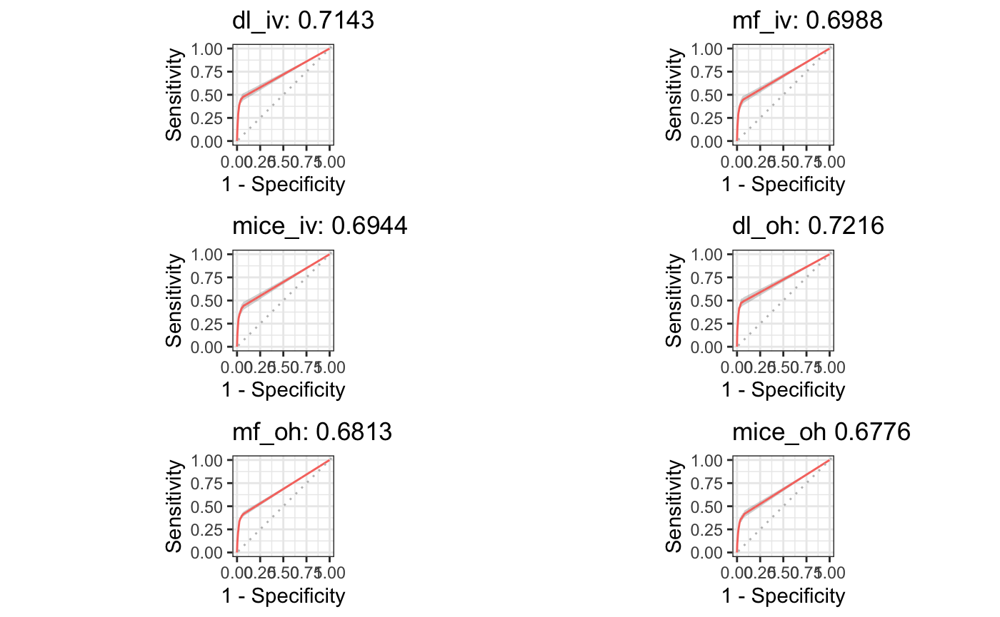
```
From the ROC plots above, we can see that KNN performs with no significant difference between different encoding and missing data handling methods. Moreover, To reduce our computation cost, we decided to take the task with the highest AUC value in this step, being **dl_iv_data**. Now, we will focus on the task **dl_iv_data**, and fine-tune the parameters.

### SVM 

We set *lrn("classif.svm")* to train SVM model.
```{r eval=FALSE}
# create a benchmark to train a list of tasks with default hyperparameter settings
design <- benchmark_grid(
  tasks = task_all,
  learners = lrn("classif.svm", predict_type = "prob"),
  resampling = rsmp("cv", folds = 5L)
)

# run the benchmark, and save the result
svm_bmr <- run_benchmark(design)
svm_results <- svm_bmr$aggregate(all_measures)

# plot roc curve of all tasks
multiplot_roc(svm_bmr)
```

```{r echo=FALSE,out.width = "100%", fig.pos="h"}
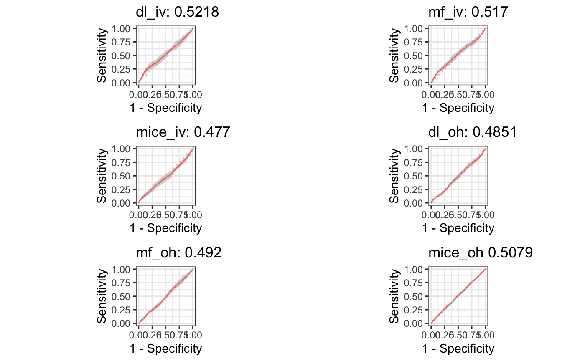
```

Similarly, we go with the **dl_iv_data** training task.

### Random Forest  

We set *lrn("classif.ranger")* to train Random Forest model.
```{r eval=FALSE}
# create a benchmark to train a list of tasks with default hyperparameter settings
design <- benchmark_grid(
  tasks = task_all,
  learners = lrn("classif.ranger", predict_type = "prob"),
  resampling = rsmp("cv", folds = 5L)
)

# run the benchmark, and save the result
rf_bmr <- run_benchmark(design)
rf_results <- rf_bmr$aggregate(all_measures)

# plot roc curve of all tasks
multiplot_roc(rf_bmr)
```

```{r echo=FALSE,out.width = "100%", fig.pos="h"}
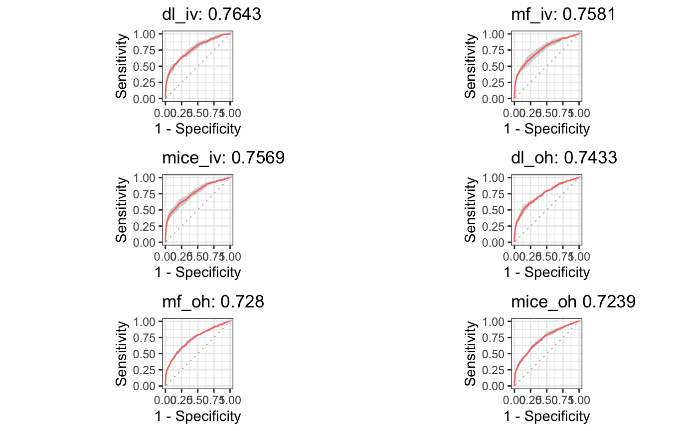
```
Similarly, we go with the **dl_iv_data** training task.


## Conclusion
according to the results above, **dl_iv_data** generally has the best prediction performance among all the six tasks with regards to 4 different models. Hence **dl_iv_data** is chosen as the final training dataset.

\newpage

# Fine-tuning

Based on the imbalanced target variable y we already have, it is crucial that we need to firstly address the imbalance problem. When it comes to deal with imbalanced data, there are two options to choose. The first method is the **smote**  and the other is the **oversampling**. In mlr3pipelines, there is a **classbalancing** and a **smote** pipe operator that can be combined with any learner. Note that **smote** has two hyperparameters *K* and *dup_size*. While *K* changes the behavior of the SMOTE algorithm, *dup_size* will affect oversampling rate of SMOTE algorithm. As for **oversampling** oeperator, there is only one hyperparameter
*oversample.ratio*, which determines the oversampling rate of **oversampling** operator.

To focus on the effect of the oversampling rate on the performance, we will consider different parameter settings with regards to the **oversampling** pipe operator which can be adapted to different training models.

when it comes to hyperparameter tuning, we need to set different learners based on the **mlr3 package** to tune tasks. The next step is to set for the hyperparameters which are used to tune with different ranges or factor levels.

We create a list of AutoTuner classes of the 4 different learners (Random Forest, SVM, Logistic and KNN) to tune the graph (4 different model learners + imbalance data correction method) based on a 3-fold CV using the classif.AUC as the performance measure. To keep runtime low, we define the resolution with grid_search to 5. However, one can also jointly tune the hyperparameter of the learner along with the imbalance correction method by extending the search space with the learner’s hyperparameters. Note that SMOTE has two hyperparameters *K* and *dup_size*. While *K* changes the behavior of the SMOTE algorithm, *dup_size* will affect oversampling rate. To focus on the effect of the oversampling rate on the performance, we will consider different parameter settings with regards to the **oversampling** pipe operator which can be adapted to different training models.

Therefore, we will need to firstly find the optimal settings for *smote.K* and *smote.dup_size* to correct the imbalanced target data distribution. Hence, we use grid search with the corresponding hyperparameter configurations for the oversampling method and each SMOTE variant for tuning. The **AutoTuner** is a fully tuned graph that behaves like a usual learner. For the innner tuning, a 3-fold CV is used. Now, we use the **benchmark** function to compare the tuned class imbalance pipeline graphs based on a 3-fold CV for the outer evaluation.
After all these tuning procedures mentioned above, we can therefore draw different parameter combinations with **ggplot** and see what the general trend is with different parameter ranges or levels to choose the optimal hyperparameter combinations for the best prediction performance. Also one thing to mention, we would generally use the y axis as the AUC value, x pixel as the tuning parameter and the color parameter as well to show the different tendencies if necessary.
Ultimately, after all these step-to-step tuning procedures, we can grab the best performance (measured by AUC value) with the recommended parameter settings and therefore improve our default models.

## Logistic Regression  


### Data balancing 

**Oversampling**  


In mlr3pipelines, there is a **classbalancing** and a **smote** pipe operator that can be combined with any learner. 
At first we use *oversampling* method to balance target variable. To do this, We define the classbalancing PipeOps by using the **po** function of **mlr3pipelines** package and set parameter as *classbalancing*. 
```{r}
# load library
library(mlr3learners)
library(mlr3tuning)
library(mlr3pipelines)
library(paradox)
task <- TaskClassif$new("dl_iv", backend = dl_iv_data, target = "y")

# logistic learner
lg_learner <- lrn("classif.log_reg", predict_type = "prob")

po_over <- po("classbalancing",
  id = "oversample", adjust = "minor",
  reference = "minor", shuffle = FALSE, ratio = 6
)

# create oversample
lg_over_learner <- GraphLearner$new(po_over %>>% lg_learner, predict_type = "prob")
```

As for *classbalancing*, *oversample.ratio* is the hyperparamter we neet to configurate. For a better exploration of *oversample.ratio*, we set a large ranging from 10 to 70.

```{r}
# define parameter
lg_over_param_set <- ParamSet$new(list(ParamDbl$new("oversample.ratio", lower = 10, upper = 70)))

# set inner resampling
inner_rsmp <- rsmp("cv", folds = 5L)

# create autotuner
lg_over_auto <- AutoTuner$new(
  learner = lg_over_learner, resampling = inner_rsmp,
  measures = msr("classif.auc"), tune_ps = lg_over_param_set,
  terminator = term("none"), tuner = tnr("grid_search", resolution = 12)
)

# set outer_resampling, and create a design with it
outer_rsmp <- rsmp("cv", folds = 3L)
lg_over_design <- benchmark_grid(
  tasks = task,
  learners = lg_over_auto,
  resamplings = outer_rsmp
)
```

With *store_models = TRUE* we allow the benchmark function to store each single model that was computed during tuning. Therefore, we can plot the tuning path of the best learner from the subsampling iterations:

```{r ,eval=FALSE,results='hide', message=FALSE, warning=FALSE}
set.seed(2020)

# create benchmark
lg_over_bmr <- benchmark(lg_over_design, store_models = TRUE)

# aggregate to get results of model
# run the benchmark, and save the result
lg_over_bmr <- run_benchmark(lg_over_design)

# aggregate to get results of model
lg_over_results <- lg_over_bmr$aggregate(measures = msr("classif.auc"))

# inspect auc value.
lg_over_results$classif.auc
# lg_over_results = 0.7159998


# plot oversample ratio vs AUC
library(ggplot2)
over_path1 <- lg_over_bmr$data$learner[[1]]$archive("params")
over_gg1 <- ggplot(over_path1, aes(
  x = oversample.ratio,
  y = classif.auc
)) +
  geom_point(size = 3) +
  geom_line()

over_path2 <- lg_over_bmr$data$learner[[2]]$archive("params")
over_gg2 <- ggplot(over_path2, aes(
  x = oversample.ratio,
  y = classif.auc
)) +
  geom_point(size = 3) +
  geom_line()

over_path3 <- lg_over_bmr$data$learner[[3]]$archive("params")
over_gg3 <- ggplot(over_path3, aes(
  x = oversample.ratio,
  y = classif.auc
)) +
  geom_point(size = 3) +
  geom_line() 

# combine all plots in one
library(ggpubr)
ggarrange(over_gg1, over_gg2, over_gg3, common.legend = TRUE, legend = "bottom")
```

```{r echo=FALSE,out.width = "100%", fig.pos="h"}
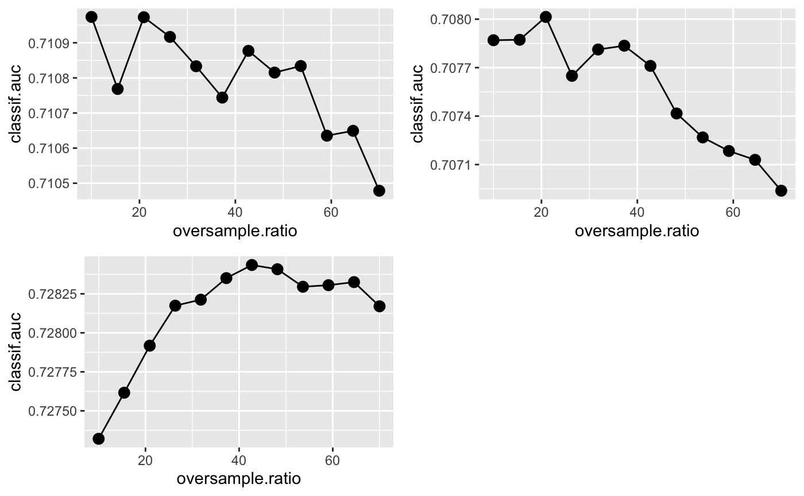
```

We can see from the plots above, logistic regression seems to get better performance when the value of *oversample.ratio* is round 20 and 40. We can not determine the final value of this hyperparameter. Otherwise, we proceed another search with ranging from 15 to 45 to find the best value of *oversample.ratio*. 
 
```{r}
# set oversample.ratio tuning range
lg_over_param_set <- ParamSet$new(list(ParamDbl$new("oversample.ratio", lower = 5, upper = 45)))

# create autotuner
lg_over_auto <- AutoTuner$new(
  learner = lg_over_learner, resampling = inner_rsmp,
  measures = msr("classif.auc"), tune_ps = lg_over_param_set,
  terminator = term("none"), tuner = tnr("grid_search", resolution = 7)
)

# set outer_resampling, and create a design with it
outer_rsmp <- rsmp("cv", folds = 3L)
lg_over_design <- benchmark_grid(
  tasks = task,
  learners = lg_over_auto,
  resamplings = outer_rsmp
)
```

```{r ,eval=FALSE,results='hide', message=FALSE, warning=FALSE}

# run benchmark, and save result
lg_over_bmr <- run_benchmark(lg_over_design)

# aggregate to get results of model
lg_over_results <- lg_over_bmr$aggregate(measures = msr("classif.auc"))

# inspect auc value.
lg_over_results$classif.auc
# lg_over_results = 0.7212002

# plot oversample.ratio v.s. AUC
library(ggplot2)
over_path1 <- lg_over_bmr$data$learner[[1]]$archive("params")
over_gg1 <- ggplot(over_path1, aes(
  x = oversample.ratio,
  y = classif.auc
)) +
  geom_point(size = 3) +
  geom_line()

over_path2 <- lg_over_bmr$data$learner[[2]]$archive("params")
over_gg2 <- ggplot(over_path2, aes(
  x = oversample.ratio,
  y = classif.auc
)) +
  geom_point(size = 3) +
  geom_line()

over_path3 <- lg_over_bmr$data$learner[[3]]$archive("params")
over_gg3 <- ggplot(over_path3, aes(
  x = oversample.ratio,
  y = classif.auc
)) +
  geom_point(size = 3) +
  geom_line()
library(ggpubr)

# combine all plots in one
ggarrange(over_gg1, over_gg2, over_gg3, common.legend = TRUE, legend = "bottom")
```

```{r echo=FALSE,out.width = "100%", fig.pos="h"}
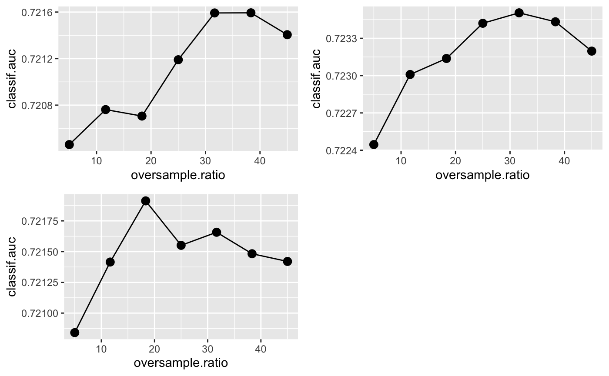
```

We noticed that two of three plots reach the best AUC value when the value of *oversample.ratio* is 30. Thus we choose the hyperparameter as 30. In conclusion, simple logistic regression achieves the best performance with AUC value 0.7236 when the value of *oversample.ratio* is 30. What is unexpected is that the AUC value of logistic regression does not increase but even slightly decreases after balancing target variable, from 0.7248 to 0.7212. It suggests that *oversampling* method may not be suitable for our dataset.

Since there is no hyperparameter in *log_reg* method, we then use SMOTE method to balance target variable.
We want to determine which method is suitable for our dataset.

**SMOTE**

We define the smote PipeOps by using the **po** function of **mlr3pipelines** package and set parameter as *smote*.

```{r}
library(mlr3learners)
library(mlr3tuning)
library(mlr3pipelines)
library(paradox)

task <- TaskClassif$new("dl_iv", backend = dl_iv_data, target = "y")

# logistic learner
lg_learner <- lrn("classif.log_reg", predict_type = "prob")

# create smote
po_smote <- po("smote", dup_size = 50)
lg_smote_learner <- GraphLearner$new(po_smote %>>% lg_learner, predict_type = "prob")
```

In *smote* method of **mlr3** package, there are 2 hyperparameters that need to be configured. Since our target variable is extremely imbalanced and with the results of rough experimentation, we set hyperparameters *smote.dup_size* ranging from 20 to 60 and *smote.K* ranging from 10 to 20.

```{r}
lg_smote_param_set <- ParamSet$new(params = list(
  ParamInt$new("smote.dup_size", lower = 20, upper = 60),
  ParamInt$new("smote.K", lower = 10, upper = 20)
))

# set outer_resampling, and create a design with it
inner_rsmp <- rsmp("cv", folds = 3L)
lg_smote_auto <- AutoTuner$new(
  learner = lg_smote_learner, resampling = inner_rsmp,
  measures = msr("classif.auc"), tune_ps = lg_smote_param_set,
  terminator = term("none"), tuner = tnr("grid_search", resolution = 5)
)

# set outer_resampling, and create a design with it
outer_rsmp <- rsmp("cv", folds = 3L)
lg_smote_design <- benchmark_grid(
  tasks = task,
  learners = lg_smote_auto,
  resamplings = outer_rsmp
)
```

With *store_models = TRUE* we allow the benchmark function to store each single model that was computed during tuning. Therefore, we can plot the tuning path of the best learner from the subsampling iterations:

```{r, eval=FALSE ,results='hide', message=FALSE, warning=FALSE}

# run benchmark, and save result
lg_smote_bmr <- run_benchmark(lg_smote_design)

lg_smote_results <- lg_smote_bmr$aggregate(measures = msr("classif.auc"))
lg_smote_results$classif.auc

# plot smote parameters v.s. AUC

over_path1 <- lg_smote_bmr$data$learner[[1]]$archive("params")
over_gg1 <- ggplot(over_path1, aes(
  x = smote.dup_size,
  y = classif.auc, col = factor(smote.K)
)) +
  geom_point(size = 3) +
  geom_line()

over_path2 <- lg_smote_bmr$data$learner[[2]]$archive("params")
over_gg2 <- ggplot(over_path2, aes(
  x = smote.dup_size,
  y = classif.auc, col = factor(smote.K)
)) +
  geom_point(size = 3) +
  geom_line()

over_path3 <- lg_smote_bmr$data$learner[[3]]$archive("params")
over_gg3 <- ggplot(over_path3, aes(
  x = smote.dup_size,
  y = classif.auc, col = factor(smote.K)
)) +
  geom_point(size = 3) +
  geom_line()

# combine all plots in one
library(ggpubr)
ggarrange(over_gg1, over_gg2, over_gg3, common.legend = TRUE, legend = "bottom")
```

```{r echo=FALSE,out.width = "100%", fig.pos="h"}
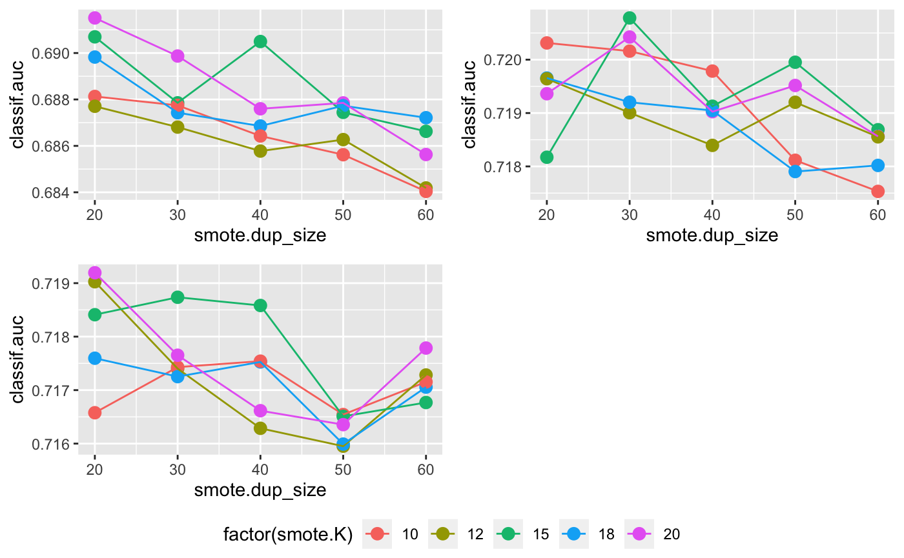
```

As shown on the plots above, the green line has the best performance on average, and two plots get the best performance at
*smote.dup_size* equals 40. hence, it is better to choose *smote.K* with value 15. As for *smote.dup_size*, we will proceed another serach with ranging from 25 to 55 to obtain a considerably better prediction performance.

```{r}

# create smote
po_smote <- po("smote", K = 15)
lg_smote_learner <- GraphLearner$new(po_smote %>>% lg_learner, predict_type = "prob")

# set range for tuning smote.dup_size
lg_smote_param_set <- ParamSet$new(params = list(
  ParamInt$new("smote.dup_size", lower = 25, upper = 50)
))

# set outer_resampling, and create a design with it
lg_smote_auto <- AutoTuner$new(
  learner = lg_smote_learner, resampling = inner_rsmp,
  measures = msr("classif.auc"), tune_ps = lg_smote_param_set,
  terminator = term("none"), tuner = tnr("grid_search", resolution = 5)
)

# set outer_resampling, and create a design with it
outer_rsmp <- rsmp("cv", folds = 3L)
lg_smote_design <- benchmark_grid(
  tasks = task,
  learners = lg_smote_auto,
  resamplings = outer_rsmp
)
```


```{r, eval=FALSE ,results='hide', message=FALSE, warning=FALSE}
# run benchmark, and save the result
lg_smote_bmr <- run_benchmark(lg_smote_design)

lg_smote_results <- lg_smote_bmr$aggregate(measures = msr("classif.auc"))
lg_smote_results$classif.auc
# 0.7253

# plot smote parameters v.s. AUC
over_path1 <- lg_smote_bmr$data$learner[[1]]$archive("params")
over_gg1 <- ggplot(over_path1, aes(
  x = smote.dup_size,
  y = classif.auc, col = factor(smote.K)
)) +
  geom_point(size = 3) +
  geom_line()

over_path2 <- lg_smote_bmr$data$learner[[2]]$archive("params")
over_gg2 <- ggplot(over_path2, aes(
  x = smote.dup_size,
  y = classif.auc, col = factor(smote.K)
)) +
  geom_point(size = 3) +
  geom_line()

over_path3 <- lg_smote_bmr$data$learner[[3]]$archive("params")
over_gg3 <- ggplot(over_path3, aes(
  x = smote.dup_size,
  y = classif.auc, col = factor(smote.K)
)) +
  geom_point(size = 3) +
  geom_line()

# combine all plots in one
library(ggpubr)
ggarrange(over_gg1, over_gg2, over_gg3, common.legend = TRUE, legend = "bottom")
```

```{r echo=FALSE,out.width = "100%", fig.pos="h"}
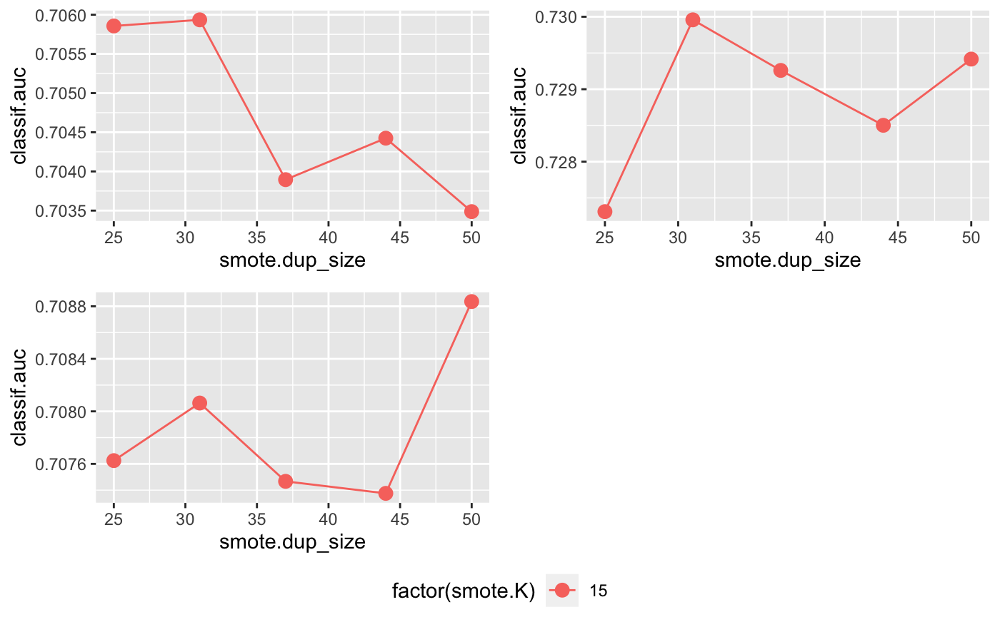
```

Shown on the plots above, we have noticed that two of three plots suggest the best value of *smote.dup_size* is 31.
Thus we finaly choose the value of *smote.dup_size* as 31.

we have managed to reach our best prediction performance with AUC value fixed at 0.7253 which shows the improvement of 0.0005 in comparison with the performance of default logistic regression model with value 0.7248. 

After using two different method to balance target variable, the prediction performance of logistic regression model does not obtain a significant improvement and it is noteworthy that *oversampling* even decreases the model performance, this suggests that *oversampling* method may not be suitable for our dataset.

## KNN  

### Data balancing  

**Oversampling**

```{r, eval=FALSE ,results='hide', message=FALSE, warning=FALSE}

knn_learner <- lrn("classif.kknn", predict_type = "prob")

# create oversampling, and combine it with current learner
po_over = po("classbalancing",
             id = "oversample", adjust = "minor",
             reference = "minor", shuffle = FALSE, ratio = 5)
lrn_over <- GraphLearner$new(po_over %>>% knn_learner, predict_type = "prob")

# setting oversample.ratio tuning range
knn_over_param_set <- ParamSet$new(list(ParamDbl$new("oversample.ratio", lower = 10, upper = 70)))


knn_over_auto <- AutoTuner$new(learner = lrn_over, resampling = inner_rsmp, 
                               measures = msr("classif.auc"), tune_ps = knn_over_param_set,
                               terminator = term("none"), tuner = tnr("grid_search", resolution = 5))


# set outer_resampling, and create a design with it
design_over = benchmark_grid(
  tasks = task,
  learners = knn_over_auto,
  resamplings = outer_rsmp
)

# run the benchmark, save the results afterwards
knn_over_bmr <- run_benchmark(design_over)


# plot oversample.ratio v.s. AUC
over_path1 = knn_over_bmr$data$learner[[1]]$archive("params")
over_gg1 = ggplot(over_path1, aes(
  x = oversample.ratio,
  y = classif.auc)) +
  geom_point(size = 3) +
  geom_line()

over_path2 = knn_over_bmr$data$learner[[2]]$archive("params")
over_gg2 = ggplot(over_path2, aes(
  x = oversample.ratio,
  y = classif.auc)) +
  geom_point(size = 3) +
  geom_line()

over_path3 = knn_over_bmr$data$learner[[3]]$archive("params")
over_gg3 = ggplot(over_path3, aes(
  x = oversample.ratio,
  y = classif.auc)) +
  geom_point(size = 3) +
  geom_line()

# combine all plots in one
library(ggpubr)
ggarrange(over_gg1, over_gg2, over_gg3, common.legend = TRUE, legend="bottom")

```

```{r echo=FALSE,out.width = "100%", fig.pos="h"}
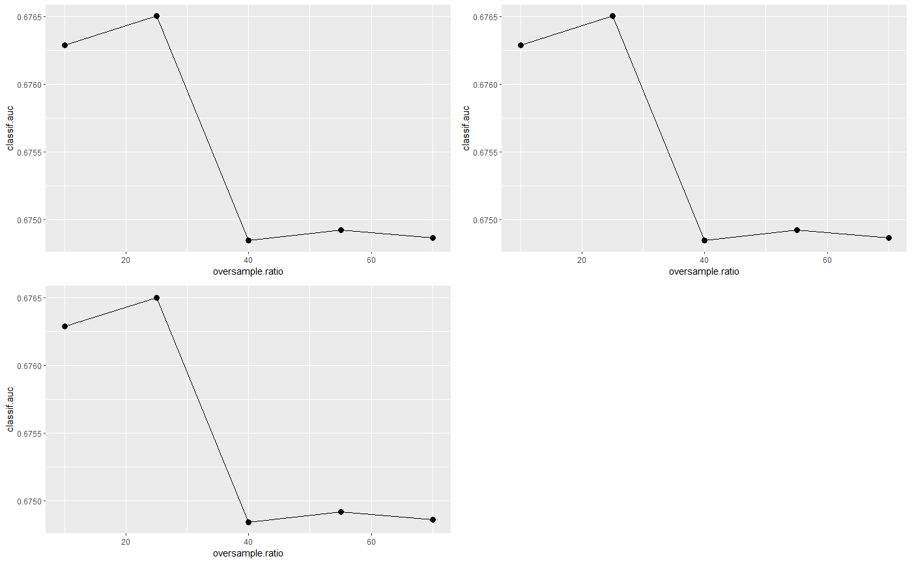
```

In the plots above, we see apart from the second plot, the other two plots have the highest AUC at the value at *oversample.ratio*=25. However, if we take a closer look at the y-axis, we notice that the scale is rather small. Thus, it is hard to say whether oversampling is improving the results or not. We will need to do further fine-tuning to find out. Here, we will fix *oversample.ratio* to 25 as it is slightly better, as shown in the plots.

**SMOTE**

In this section, we will use the package **SMOTE** that is included in **mlr3**, to see whethere balancing the data with smote may improve the prediction of the model.

```{r, eval=FALSE ,results='hide', message=FALSE, warning=FALSE}
knn_learner <- lrn("classif.kknn", predict_type = "prob")

# create smote, and combine it with the current learner
po_smote = po("smote", dup_size = 50)
lrn_smote <- GraphLearner$new(po_smote %>>% knn_learner, predict_type = "prob")

# setting smote parameters' tuning range
knn_smote_param_set <- ParamSet$new(params = list(ParamInt$new("smote.dup_size", lower = 20, upper = 60),
                                            ParamInt$new("smote.K", lower = 10, upper = 20)))

# create autotuner, using the inner sampling and tuning parameter with random search
inner_rsmp <- rsmp("cv",folds = 3L)
knn_smote_auto <- AutoTuner$new(learner = lrn_smote, resampling = inner_rsmp, 
                               measures = msr("classif.auc"), tune_ps = knn_smote_param_set,
                               terminator = term("none"), tuner = tnr("grid_search", resolution = 5))

# set outer_resampling, and create a design with it
outer_rsmp <- rsmp("cv", folds = 3L)
design_smote = benchmark_grid(
  tasks = task,
  learners = knn_smote_auto,
  resamplings = outer_rsmp
)

# run the benchmark, save the results afterwards
knn_smote_bmr <- run_benchmark(design_smote)


# plot smote parameters v.s. AUC
smote_path1 = knn_smote_bmr$data$learner[[1]]$archive("params")
smote_gg1 = ggplot(smote_path1, aes(
  x = smote.dup_size,
  y = classif.auc, col = factor(smote.K))) +
  geom_point(size = 3) +
  geom_line() 

smote_path2 = knn_smote_bmr$data$learner[[2]]$archive("params")
smote_gg2 = ggplot(smote_path2, aes(
  x = smote.dup_size,
  y = classif.auc, col = factor(smote.K))) +
  geom_point(size = 3) +
  geom_line()

smote_path3 = knn_smote_bmr$data$learner[[3]]$archive("params")
smote_gg3 = ggplot(smote_path3, aes(
  x = smote.dup_size,
  y = classif.auc, col = factor(smote.K))) +
  geom_point(size = 3) +
  geom_line()

# combine all plots in one
ggarrange(smote_gg1, smote_gg2, smote_gg3, common.legend = TRUE, legend="bottom")

# extract final tuned parameters
smote_results <- knn_smote_bmr$score() %>%
  pull(learner) %>%
  map(pluck(c(function(x) x$tuning_result)))

```

```{r echo=FALSE,out.width = "100%", fig.pos="h"}
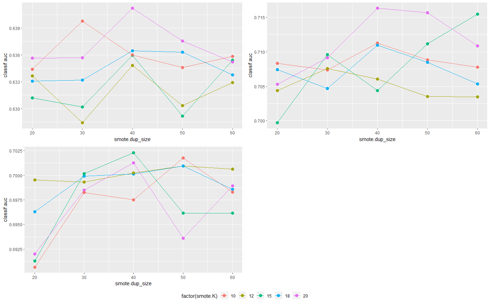
```

As we can see in the plot, we tried using **SMOTE** with different combinations of *smote.K* and *smote.dup_size*. Using three-fold cross-validation, we see three plots, and here we do not have a clear winner that outperforms all, but if we take a closer look at the pink curve (*smote.K*=20), we see that it is on top having *smote.dup_size* in the range of 40-50. Based on the trend, we will fix *smote.K* to 20 and *smote.dup_size* to 40 for further fine-tuning.

### Model tuning

**Fine-tuning (Oversampling)**

```{r, eval=FALSE ,results='hide', message=FALSE, warning=FALSE}

# create oversampling with previously tuned value
po_over_tuned <- po("classbalancing",
                    id = "oversample", adjust = "minor",
                    reference = "minor", shuffle = FALSE, ratio = 25)
knn_over_lrn <- GraphLearner$new(po_over_tuned %>>% lrn("classif.kknn", 
                          predict_type = "prob"), predict_type = "prob")

# set distance range for tuning
para_dist <- ParamSet$new(params = list(ParamInt$new("classif.kknn.distance", lower = 1, upper = 5)))


knn_over_dist <- AutoTuner$new(
  learner = knn_over_lrn, resampling = inner_rsmp,
  measures = msr("classif.auc"), tune_ps = para_dist,
  terminator = term("none"), tuner = tnr("grid_search", resolution = 5))

design_over_dist <- benchmark_grid(
  tasks = task,
  learners = knn_over_dist,
  resamplings = outer_rsmp
)

bmr_over_dist <- run_benchmark(design_over_dist)

# plot distance v.s. AUC
over_dist_path1 = bmr_over_dist$data$learner[[1]]$archive("params")
over_dist_gg1 = ggplot(over_dist_path1, aes(
  x = classif.kknn.distance,
  y = classif.auc)) +
  geom_point(size = 3) +
  geom_line()

over_dist_path2 = bmr_over_dist$data$learner[[2]]$archive("params")
over_dist_gg2 = ggplot(over_dist_path2, aes(
  x = classif.kknn.distance,
  y = classif.auc)) +
  geom_point(size = 3) +
  geom_line()

over_dist_path3 = bmr_over_dist$data$learner[[3]]$archive("params")
over_dist_gg3 = ggplot(over_dist_path3, aes(
  x = classif.kknn.distance,
  y = classif.auc)) +
  geom_point(size = 3) +
  geom_line()

# combine all plots into one
ggarrange(over_dist_gg1, over_dist_gg2, over_dist_gg3, common.legend = TRUE, legend="bottom")


# extract final tuned parameters
over_dist_para <- bmr_over_dist$score() %>%
    pull(learner) %>%
    map(pluck(c(function(x) x$tuning_result)))

```

```{r echo=FALSE,out.width = "100%", fig.pos="h"}
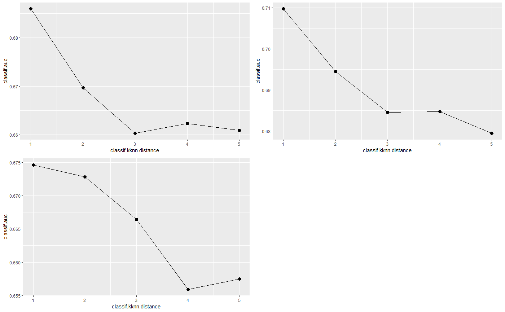
```

In this part, we first tune the parameter *distance* from KNN, and we can see that all three sections of the data have very similar. It has the highest AUC at *distance*=1, and gradually declines till *distance*=3. After 3 the AUC performs differently but does not surpass the value with the setting *distance*=1. Furthermore, here we will fix the parameter to 1, and explore other parameters in detail.

```{r, eval=FALSE ,results='hide', message=FALSE, warning=FALSE}
# list all kernel from KNN
kernel_type <- c("rectangular", "triangular", "epanechnikov", "biweight"
                , "triweight", "cos", "inv", "gaussian", "rank", "optimal")

knn_over_lrn <- GraphLearner$new(po_over_tuned %>>% lrn("classif.kknn", predict_type = "prob", distance=1), predict_type = "prob")
para_kernel <- ParamSet$new(params = list(ParamFct$new("classif.kknn.kernel", levels = kernel_type)))

knn_over_kernel <- AutoTuner$new(
  learner = knn_over_lrn, resampling = inner_rsmp,
  measures = msr("classif.auc"), tune_ps = para_kernel,
  terminator = term("none"), tuner = tnr("grid_search", resolution = 10))

design_over_kernel <- benchmark_grid(
  tasks = task,
  learners = knn_over_kernel,
  resamplings = outer_rsmp
)

bmr_over_kern <- run_benchmark(design_over_kernel)
over_kern_para <- bmr_over_kern$score() %>%
  pull(learner) %>%
  map(pluck(c(function(x) x$tuning_result)))

# extract top kernels from 3-fold cv
selected_kernel <- c(over_kern_para[[1]]$params$classif.kknn.kernel,
over_kern_para[[2]]$params$classif.kknn.kernel,
over_kern_para[[3]]$params$classif.kknn.kernel)

# list selected top kernel
selected_kernel

```


```{r echo=FALSE,out.width = "100%", fig.pos="h"}
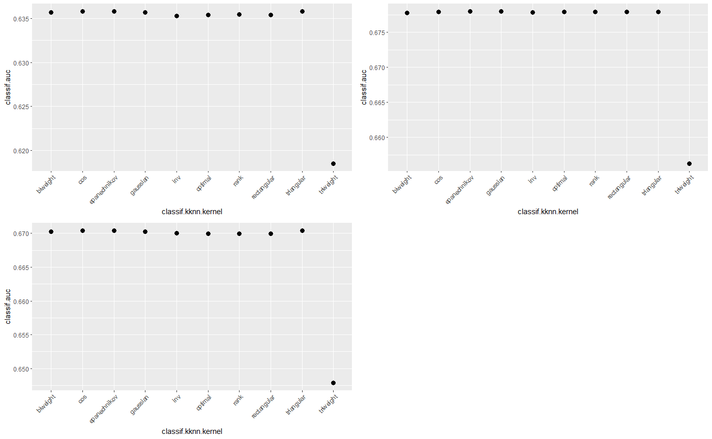
print(c("triangular", "biweight", "epanechnikov"))
```

In this section, we explore the parameter *kernel* from KNN. From the plot shown above, there is no apparent difference between different kernels, except *triweight* being the lowest in all three plots. To reduce the computational cost and perform further fine-tuning, we will select the top kernel from each plot, being *triangular*, *biweight*, and *epanechnikov*, and tune *k* with these selected kernels.


```{r, eval=FALSE ,results='hide', message=FALSE, warning=FALSE}
# tune k with selected kernels
knn_over_lrn <- GraphLearner$new(po_over_tuned %>>% lrn("classif.kknn", 
                      predict_type = "prob", distance=1), predict_type = "prob")
para_k <- ParamSet$new(params = list(ParamInt$new("classif.kknn.k", lower = 20, upper = 100), 
                                     ParamFct$new("classif.kknn.kernel", levels = selected_kern)))

knn_over_k <- AutoTuner$new(
  learner = knn_over_lrn, resampling = inner_rsmp,
  measures = msr("classif.auc"), tune_ps = para_k,
  terminator = term("none"), tuner = tnr("grid_search", resolution = 5))

design_over_k = benchmark_grid(
  tasks = task,
  learners = knn_over_k,
  resamplings = outer_rsmp
)

bmr_over_k <- run_benchmark(design_over_k)

# plot k v.s. AUC (with kernel colored)
over_k_path1 = bmr_over_k$data$learner[[1]]$archive("params")
over_k_gg1 = ggplot(over_k_path1, aes(
  x = classif.kknn.k,
  y = classif.auc, col = classif.kknn.kernel)) +
  geom_point(size = 3) +
  geom_line()

over_k_path2 = bmr_over_k$data$learner[[2]]$archive("params")
over_k_gg2 = ggplot(over_k_path2, aes(
  x = classif.kknn.k,
  y = classif.auc, col = classif.kknn.kernel)) +
  geom_point(size = 3) +
  geom_line()

over_k_path3 = bmr_over_k$data$learner[[3]]$archive("params")
over_k_gg3 = ggplot(over_k_path3, aes(
  x = classif.kknn.k,
  y = classif.auc, col = classif.kknn.kernel)) +
  geom_point(size = 3) +
  geom_line()

# combine all plots into one
ggarrange(over_k_gg1, over_k_gg2, over_k_gg3, common.legend = TRUE, legend="bottom")

```


```{r echo=FALSE,out.width = "100%", fig.pos="h"}
knitr::include_graphics("img/2_4_knn_over_k_kern.png")
```

Finally, we want to tune *k* with kernels we selected in the previous section. Beside *epanechnikov* being lowest in all plot, there is no straightforward winner between *triangular* and *biweight*. We can see that AUC is the highest in the range of 40 to 80. If we take a closer look in this range, we notice that *triangular* is slightly better. Based on the trend of the 3 plots above, it is reasonable to select *triangular* as our kernel, with *k* set to 80.

**Fine-tuning (SMOTE)**

```{r, eval=FALSE ,results='hide', message=FALSE, warning=FALSE}

inner_rsmp <- rsmp("cv",folds = 3L)
outer_rsmp <- rsmp("cv", folds = 3L)

# list all kernel types
kernel_type <- c("rectangular", "triangular", "epanechnikov", "biweight"
                , "triweight", "cos", "inv", "gaussian", "rank", "optimal")

# set parameter tuning for each parameter
para_k <- ParamSet$new(params = list(ParamInt$new("classif.kknn.k", lower = 20, upper = 100)))
para_dist <- ParamSet$new(params = list(ParamInt$new("classif.kknn.distance", lower = 1, upper = 5)))
para_kernel <- ParamSet$new(params = list(ParamFct$new("classif.kknn.kernel", levels = kernel_type)))

# define smote, and combine it with knn learner
po_smote_tuned <- po("smote", dup_size = 40, K = 15)
knn_smote_lrn <- GraphLearner$new(po_smote_tuned %>>% lrn("classif.kknn", 
                      predict_type = "prob"), predict_type = "prob")

# tune distance
knn_smote_dist <- AutoTuner$new(
  learner = knn_smote_lrn, resampling = inner_rsmp,
  measures = msr("classif.auc"), tune_ps = para_dist,
  terminator = term("none"), tuner = tnr("grid_search", resolution = 5))

design_smote_dist <- benchmark_grid(
  tasks = task,
  learners = knn_smote_dist,
  resamplings = outer_rsmp
)

bmr_smote_dist <- run_benchmark(design_smote_dist)

# plot distance v.s. AUC
smote_dist_path1 = bmr_smote_dist$data$learner[[1]]$archive("params")
smote_dist_gg1 = ggplot(smote_dist_path1, aes(
  x = classif.kknn.distance,
  y = classif.auc)) +
  geom_point(size = 3) +
  geom_line()

smote_dist_path2 = bmr_smote_dist$data$learner[[2]]$archive("params")
smote_dist_gg2 = ggplot(smote_dist_path2, aes(
  x = classif.kknn.distance,
  y = classif.auc)) +
  geom_point(size = 3) +
  geom_line()

smote_dist_path3 = bmr_smote_dist$data$learner[[3]]$archive("params")
smote_dist_gg3 = ggplot(smote_dist_path3, aes(
  x = classif.kknn.distance,
  y = classif.auc)) +
  geom_point(size = 3) +
  geom_line()

ggarrange(smote_dist_gg1, smote_dist_gg2, smote_dist_gg3, common.legend = TRUE, legend="bottom")

```

```{r echo=FALSE,out.width = "100%", fig.pos="h"}
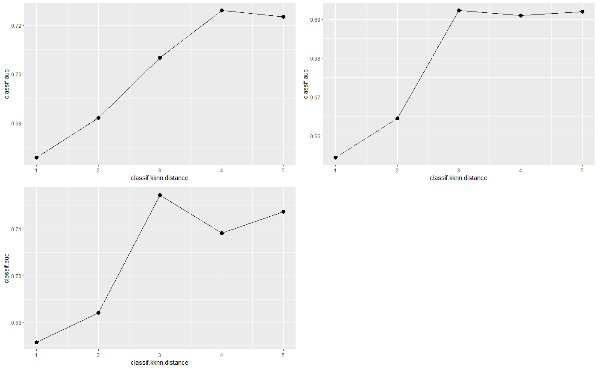
```

First, we only tune the parameter *distance* with all other parameters fixed to default to evaluate the influence of the parameter *distance*. In the plot above, we can see that the AUC grows as we increase the value of *distance*. Still, after 3, there is no significant improvement and even declines in one plot. Based on this, we will fix the value to 3 to perform further fine-tuning.

```{r, eval=FALSE ,results='hide', message=FALSE, warning=FALSE}

# tune kernel with selected distance
knn_smote_lrn <- GraphLearner$new(po_smote_tuned %>>% lrn("classif.kknn", 
                  predict_type = "prob", distance=3), predict_type = "prob")
knn_smote_kernel <- AutoTuner$new(
  learner = knn_smote_lrn, resampling = inner_rsmp,
  measures = msr("classif.auc"), tune_ps = para_kernel,
  terminator = term("none"), tuner = tnr("grid_search", resolution = 10))

design_smote_kernel <- benchmark_grid(
  tasks = task,
  learners = knn_smote_kernel,
  resamplings = outer_rsmp
)

bmr_smote_kern <- run_benchmark(design_smote_kernel)

# plot kernel v.s. AUC
thm = theme(axis.text.x = element_text(angle = 45, hjust = 1))
smote_kern_path1 = bmr_smote_kern$data$learner[[1]]$archive("params")
smote_kern_gg1 = ggplot(smote_kern_path1, aes(
  x = classif.kknn.kernel,
  y = classif.auc)) +
  geom_point(size = 3) +
  geom_line() + thm

smote_kern_path2 = bmr_smote_kern$data$learner[[2]]$archive("params")
smote_kern_gg2 = ggplot(smote_kern_path2, aes(
  x = classif.kknn.kernel,
  y = classif.auc)) +
  geom_point(size = 3) +
  geom_line() + thm

smote_kern_path3 = bmr_smote_kern$data$learner[[3]]$archive("params")
smote_kern_gg3 = ggplot(smote_kern_path3, aes(
  x = classif.kknn.kernel,
  y = classif.auc)) +
  geom_point(size = 3) +
  geom_line() + thm

ggarrange(smote_kern_gg1, smote_kern_gg2, smote_kern_gg3, common.legend = TRUE, legend="bottom")

```

```{r echo=FALSE,out.width = "100%", fig.pos="h"}
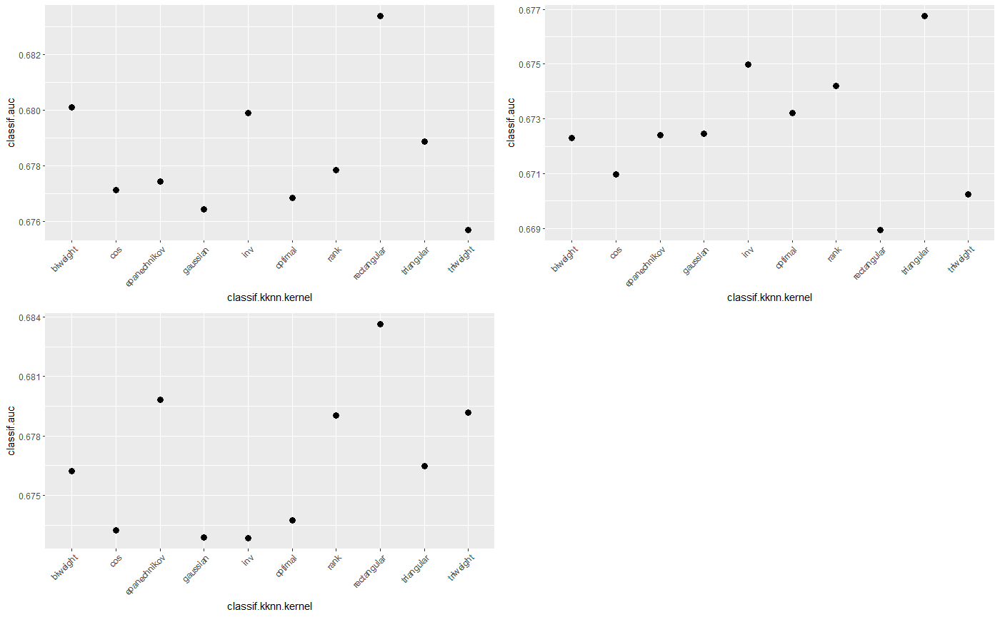
```

Now with the *distance* fixed to 3, we compare how each kernel influences the AUC. As we can see, the scale of the y-axis is considerably small, meaning that there is no vast difference between kernels. But to reduce the computation cost, we will the one with the highest AUC in each plot, being: *rectangular*, *triangular*, and we will additionally take *gaussian* for comparison.

```{r, eval=FALSE ,results='hide', message=FALSE, warning=FALSE}
# tune k with selected distance and kernel
selected_kern <- c("rectangular", "triangular", "gaussian")
para_k <- ParamSet$new(params = list(ParamInt$new("classif.kknn.k", lower = 20, upper = 100), 
                                     ParamFct$new("classif.kknn.kernel", levels = selected_kern)))

knn_smote_lrn <- GraphLearner$new(po_smote_tuned %>>% lrn("classif.kknn", 
                    predict_type = "prob", distance=3), predict_type = "prob")
knn_smote_k <- AutoTuner$new(
  learner = knn_smote_lrn, resampling = inner_rsmp,
  measures = msr("classif.auc"), tune_ps = para_k,
  terminator = term("none"), tuner = tnr("grid_search", resolution = 5))

design_smote_k <- benchmark_grid(
  
  tasks = task,
  learners = knn_smote_k,
  resamplings = outer_rsmp
)

bmr_smote_k <- run_benchmark(design_smote_k)

# k and selected kernel v.s AUC
smote_k_path1 = bmr_smote_k$data$learner[[1]]$archive("params")
smote_k_gg1 = ggplot(smote_k_path1, aes(
  x = classif.kknn.k,
  y = classif.auc, col = classif.kknn.kernel)) +
  geom_point(size = 3) +
  geom_line()

smote_k_path2 = bmr_smote_k$data$learner[[2]]$archive("params")
smote_k_gg2 = ggplot(smote_k_path2, aes(
  x = classif.kknn.k,
  y = classif.auc, col = classif.kknn.kernel)) +
  geom_point(size = 3) +
  geom_line()

smote_k_path3 = bmr_smote_k$data$learner[[3]]$archive("params")
smote_k_gg3 = ggplot(smote_k_path3, aes(
  x = classif.kknn.k,
  y = classif.auc, col = classif.kknn.kernel)) +
  geom_point(size = 3) +
  geom_line()

ggarrange(smote_k_gg1, smote_k_gg2, smote_k_gg3, common.legend = TRUE, legend="bottom")

```

```{r echo=FALSE,out.width = "100%", fig.pos="h"}
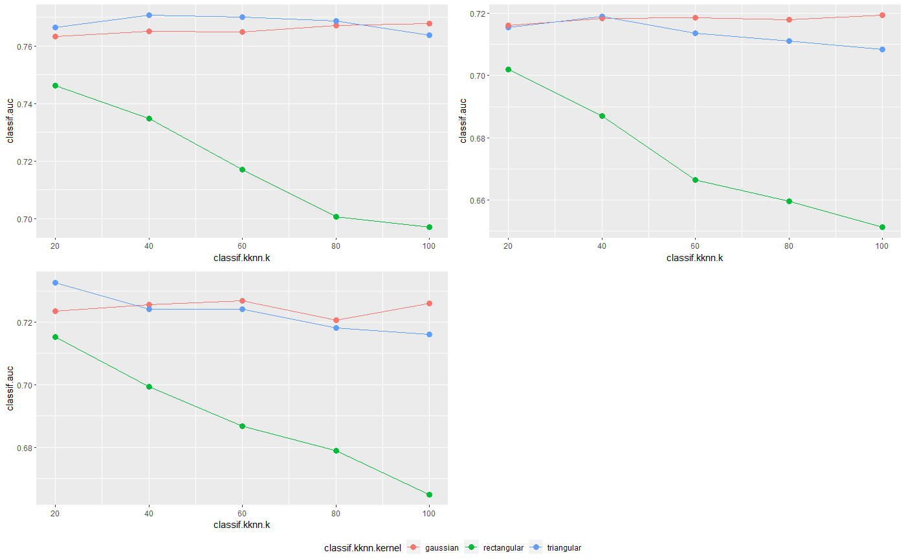
```

In the final step, we tuned *k* and *kernel* together. Here, we can see that *rectangular* falls behind both other kernels. Between *gaussian* and *triangular*, there is no obvious winner. The default value of *k* is 7, and here we selected our range 20-100 by experimenting with our data before tuning. In the previous plot (Default: *k*=7), we see there is no significant difference in the AUC between kernels. 

Furthermore, the plot above shows as *k* increase the difference between kernels becomes larger. This suggests that it would be meaningful to tune all *kernel* among *k*. However, since there is no enormous improvement in AUC and the limitation of computation power, we only tuned 3 in our experiment.

## SVM

When it comes to use the SVM learner to do the model tuning, we need to firstly load the dataset _dl_iv_data_ remained as our ultimate training dataset and then set the training task with the particular dataset and specify the target variable _y_ with regards to the prediction results. As for the final step of the pre-preparation process for machine learning with **mlr3**, we need to make the learner fixed with value __classif.svm__, which can be initialized by function **lrn** loaded in the **mlr3learners** package, underlining the participation of the SVM algorithm.

The following model tuning steps are made up of two prime procedures: data balancing, which consists of two methods: **SMOTE** and **Oversampling**, and model tuning steps with different parameters.

### Data balancing 


Considering the extremely imbalanced target variable _y_ to process, we will firstly balance the present target. In order to improve the accuracy of the prediction performance, we will need to implement mainly two methods: **SMOTE** and **Oversampling** to get the relatively balanced target variable after processing and there are no biased preference with the two data balancing methods, which means that we need to both implement the two methods on our original target variable _y_ and choose the best one with the highest AUC score after the final model tuning process.

**SMOTE function**
To implement the **SMOTE** function to balance the whole dataset, the first step is to determine the two crucial parameters _smote.dup_size_ and _smote.K_. _smote.dup_size_ means a vector of times of synthetic minority instances over original majority instances in the oversampling in each instances while _smote.K_ defines the value of parameter _K_ for nearest neighbor process used for generating data. To explain the _smote.dup_size_ further, the _dup_size_ parameter answers the question how many times the **SMOTE** function should loop through the existing, real minority instances. Therefore at _dup_size_ = 1 means only 4 new data points are synthesised (1 for each existing minority instance). At _dup_size_ = 200, 800 new data points get synthesised. However, as for _K_, at each loop iteration, one of the _K_ closest minority class neighbours is chosen and a new minority instance is synthesised somewhere between the minority instance and that neighbour. Thus, _K_ means how many of the closest neighbours are considered for synthesis. Considering the above explanations for _smote.dup_size_ and _smote.K_, we would firstly set the training ranges for _smote.dup_size_ and _smote.K_ as 10 to 60 and 10 to 25 simultaneously to adapt to the present target variable _y_, which we have where the number of 0s is almost 60 times the number of 1s.

With _smote.dup_size_ defined from 10 to 60 and _smote.K_ from 10 to 25, it is better to implement a **grid_search** to figure out what is the optimal parameter settings for the 2 parameters based on the **svm** learner and the *dl_iv_data* training task.

```{r}
# suppress svm package
suppressPackageStartupMessages(library(e1071))

## test for best matches with smote function's parameter with SVM learner
svm_lrn <- lrn("classif.svm", predict_type = "prob")

# train with smote function's 2 parameters
param_smote <- ParamSet$new(params = list(
  ParamInt$new("smote.dup_size", lower = 10, upper = 60),
  ParamInt$new("smote.K", lower = 10, upper = 25)
))

# inner resampling set
inner_rsmp <- rsmp("cv", folds = 3L)
po_smote <- po("smote", dup_size = 50)

# create smote learner fixed in svm learner
svm_smote_lrn <- GraphLearner$new(po_smote %>>% svm_lrn, predict_type = "prob")

# create Autolearner
svm_auto_smote <- AutoTuner$new(
  learner = svm_smote_lrn, resampling = inner_rsmp,
  measures = msr("classif.auc"), tune_ps = param_smote,
  terminator = term("none"), tuner = tnr("grid_search", resolution = 5)
)
```

```{r echo=FALSE,eval=FALSE}
# outer resampling set
outer_rsmp <- rsmp("cv", folds = 3L)

# design for smote
design_smote <- benchmark_grid(
  tasks = task,
  learners = svm_auto_smote,
  resampling = outer_rsmp
)

bmr_smote <- benchmark(design_smote, store_models = TRUE)

# plot smote parameters v.s. AUC
smote_path1 <- bmr_smote$data$learner[[1]]$archive("params")
svm_ggp1 <- ggplot(smote_path1, aes(
  x = smote.dup_size,
  y = classif.auc, col = factor(smote.K)
)) +
  geom_point(size = 3) +
  geom_line()

smote_path2 <- bmr_smote$data$learner[[2]]$archive("params")
svm_ggp2 <- ggplot(smote_path2, aes(
  x = smote.dup_size,
  y = classif.auc, col = factor(smote.K)
)) +
  geom_point(size = 3) +
  geom_line() 

smote_path3 <- bmr_smote$data$learner[[2]]$archive("params")
svm_ggp3 <- ggplot(smote_path3, aes(
  x = smote.dup_size,
  y = classif.auc, col = factor(smote.K)
)) +
  geom_point(size = 3) +
  geom_line() 

ggarrange(svm_ggp1, svm_ggp2, svm_ggp3, common.legend = TRUE, legend = "bottom")

```

```{r echo=FALSE,out.width = "100%", fig.pos="h"}
knitr::include_graphics("img/svm_smote.png")
```

As can be seen from the plots above, *smote.dup_size* is showing better prediction performance when defined as 40 and *smote.K* shall be defined as 21 which is having more stable training performance with color blue correspondingly.

Then the next step would be to determine which *kernel* function type to use with fixed *smote.dup_size* value and *smote.K* value.


**Oversampling**

We have decided not to use the **oversampling** method to balance the origianl target variable _y_ for two reasons. The first one is that it is computationally expensive to undergo the whole tuning process again with the **SVM** algorithm. Specifically, it almost took us two whole days to train the optimal parameter settings for the **SMOTE** function and the prediction performance measured by AUC after tuning is not as satisfactory as we have expected before. On the other hand, the best prediction performance given by the **SVM** algorithm with default parameter settings is inferior to the worst classification results shown by the **Random Forest** algorithm with no model tuning procedures.

### Model tuning

Regarding the choice of suitable kernel function with SVM, there are in total four options to choose: *linear*, *polynomial*, *radial*, *sigmoid*. The default value for the **mlr3** SVM learner is the *radical* function. Thence, we need to implement the other three kernel functions on the previous training models with the **dl_iv_data** task and again use the *grid_search* to check which *kernel* function will generate better prediction performance shown with higher AUC value.
```{r, eval=FALSE}
# train with kernel type
kernel_type <- c("linear", "polynomial", "radial", "sigmoid")
param_kernel <- ParamSet$new(params = list(ParamFct$new("classif.svm.kernel", levels = kernel_type)))
po_smote <- po("smote", dup_size = 45, K = 21)

# create smote learner fixed in rf_trees_fixed_lrn
svm_smote_lrn <- GraphLearner$new(po_smote %>>% svm_lrn, predict_type = "prob")

# create Autolearner for step 1
svm_auto_kernel <- AutoTuner$new(
  learner = svm_smote_lrn, resampling = inner_rsmp,
  measures = msr("classif.auc"), tune_ps = param_kernel,
  terminator = term("none"), tuner = tnr("grid_search", resolution = 5)
)
```

```{r echo=FALSE,eval=FALSE}
# design for smote
design_kernel <- benchmark_grid(
  tasks = task,
  learners = svm_auto_kernel,
  resampling = outer_rsmp
)

bmr_kernel <- benchmark(design_kernel, store_models = TRUE)

# plot kernel v.s. AUC
kernel_path1 <- bmr_kernel$data$learner[[1]]$archive("params")
svm_ggp1 <- ggplot(kernel_path1, aes(
  x = classif.svm.kernel,
  y = classif.auc
)) +
  geom_point(size = 3) +
  geom_line() 

kernel_path2 <- bmr_kernel$data$learner[[2]]$archive("params")
svm_ggp2 <- ggplot(kernel_path2, aes(
  x = classif.svm.kernel,
  y = classif.auc
)) +
  geom_point(size = 3) +
  geom_line() 

kernel_path3 <- bmr_kernel$data$learner[[3]]$archive("params")
svm_ggp3 <- ggplot(kernel_path3, aes(
  x = classif.svm.kernel,
  y = classif.auc
)) +
  geom_point(size = 3) +
  geom_line() 

ggarrange(svm_ggp1, svm_ggp2, svm_ggp3, common.legend = TRUE, legend = "bottom")
```


```{r echo=FALSE,out.width = "100%", fig.pos="h"}
knitr::include_graphics("img/svm_kernel.png")
```

As can seen from the plots which refer to the comparison with different *kernel* functions, the best performance is given by the *radial* function for the **dl_iv_data** task. Nevertheless, we still need to figure out the optimal choice with parameter *cost* and *gamma* and as for the tuning range for *cost*, the first try would be to set with 0.1, 1, 10 and 100 __reference__.

```{r, eval=FALSE}
svm_lrn <- lrn("classif.svm", predict_type = "prob", kernel = "radial", type = "C-classification")

# train with different set with parameter cost
param_cost <- ParamSet$new(params = list(ParamDbl$new("classif.svm.cost", lower = 0, upper = 3)))

param_cost$trafo = function(x, param_set){
  x$classif.svm.cost = 10**(x$classif.svm.cost)/10
  x
}

# create smote learner fixed un svm learner
svm_smote_lrn <- GraphLearner$new(po_smote %>>% svm_lrn, predict_type = "prob")

# create Autolearner
svm_auto_smote <- AutoTuner$new(
  learner = svm_smote_lrn, resampling = inner_rsmp,
  measures = msr("classif.auc"), tune_ps = param_cost,
  terminator = term("none"), tuner = tnr("grid_search", resolution = 3)
)
```

```{r echo=FALSE,eval=FALSE}
# design for cost
design_cost <- benchmark_grid(
  tasks = task,
  learners = svm_auto_smote,
  resampling = outer_rsmp
)

bmr_cost <- benchmark(design_cost, store_models = TRUE)


# plot svm.cost v.s. AUC
cost_path1 <- bmr_cost$data$learner[[1]]$archive("params")
svm_ggp1 <- ggplot(cost_path1, aes(
  x = classif.svm.cost,
  y = classif.auc
)) +
  geom_point(size = 3) +
  geom_line() 

cost_path2 <- bmr_cost$data$learner[[2]]$archive("params")
svm_ggp2 <- ggplot(cost_path2, aes(
  x = classif.svm.cost,
  y = classif.auc
)) +
  geom_point(size = 3) +
  geom_line() 

cost_path3 <- bmr_cost$data$learner[[3]]$archive("params")
svm_ggp3 <- ggplot(cost_path3, aes(
  x = classif.svm.cost,
  y = classif.auc
)) +
  geom_point(size = 3) +
  geom_line() 

ggarrange(svm_ggp1, svm_ggp2, svm_ggp3, common.legend = TRUE, legend = "bottom")
```


```{r eval=FALSE,echo=FALSE,out.width = "100%", fig.pos="h"}
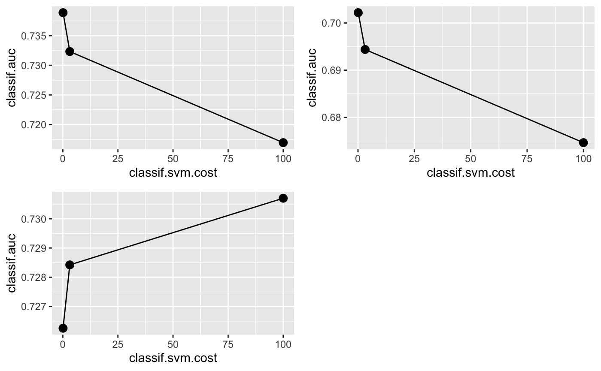
```

Shown on the three plots above, two of them are suggesting that by setting _classif.svm.cost_ to 0.1 will lead to the highest AUC score. Thus, it is better to choose *cost* with value 0.1. Hence, the last step would be to tune *gamma* for the **dl_iv_data** training task. Configuing the training set with [1, 0.1, 0.01, 0.001] for *gamma* as suggested by __[reference]__, we would like to see the changing trend of the tuning performance and determine for the ultimate *gamma* accordingly.

```{r eval=FALSE}
svm_lrn <- lrn("classif.svm", predict_type = "prob", kernel = "radial", cost = 0.1, type = "C-classification")

# train with gamm
param_gamma <- ParamSet$new(params = list(ParamDbl$new("classif.svm.gamma", lower = 0, upper = 3)))

param_cost$trafo = function(x, param_set){
  x$classif.svm.gamma = 10 ** (x$classif.svm.gamma) / 10**3
  x
}

po_smote <- po("smote", dup_size = 45, K = 21)

# create smote learner
svm_smote_lrn <- GraphLearner$new(po_smote %>>% svm_lrn, predict_type = "prob")

# create Autolearner for step 1
svm_auto_smote <- AutoTuner$new(
  learner = svm_smote_lrn, resampling = inner_rsmp,
  measures = msr("classif.auc"), tune_ps = param_gamma,
  terminator = term("none"), tuner = tnr("grid_search", resolution = 4)
)
```

```{r echo=FALSE,eval=FALSE}
# design for gamma
design_gamma <- benchmark_grid(
  tasks = task,
  learners = svm_auto_smote,
  resampling = outer_rsmp
)

bmr_gamma <- benchmark(design_gamma, store_models = TRUE)
bmr_gamma_result <- bmr_gamma$aggregate(msr("classif.auc"))

# plot svm.gamma v.s. AUC
gamma_path1 <- bmr_gamma$data$learner[[1]]$archive("params")
svm_ggp1 <- ggplot(gamma_path1, aes(
  x = classif.svm.gamma,
  y = classif.auc
)) +
  geom_point(size = 3) +
  geom_line() 

gamma_path2 <- bmr_gamma$data$learner[[2]]$archive("params")
svm_ggp2 <- ggplot(gamma_path2, aes(
  x = classif.svm.gamma,
  y = classif.auc
)) +
  geom_point(size = 3) +
  geom_line() 

gamma_path3 <- bmr_gamma$data$learner[[3]]$archive("params")
svm_ggp3 <- ggplot(gamma_path3, aes(
  x = classif.svm.gamma,
  y = classif.auc
)) +
  geom_point(size = 3) +
  geom_line() 

ggarrange(svm_ggp1, svm_ggp2, svm_ggp3, common.legend = TRUE, legend = "bottom")
```

```{r eval=FALSE,echo=FALSE,out.width = "100%", fig.pos="h"}
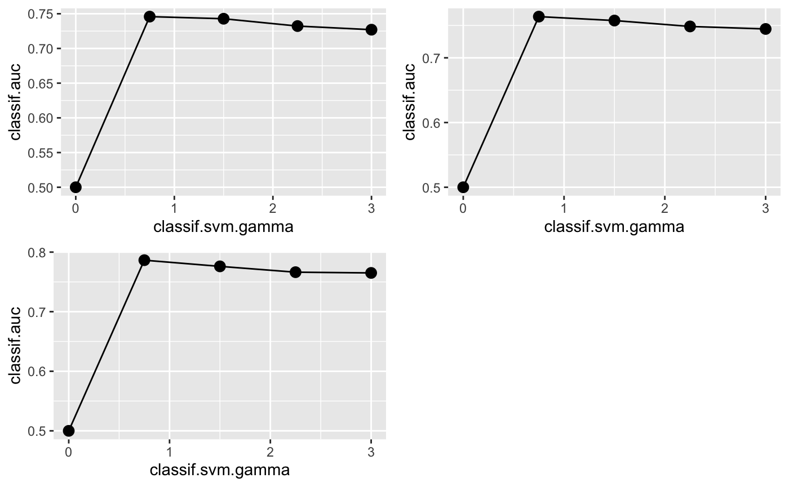
```

As suggested by the three plots simultaneously, _classif.auc_ will always reach the summit when _classif.svm.gamma_ is chosen with value 0.75.

In conclusion, it is better to go with _radial_ kernel function, _cost_ being set to 0.1 and _gamma_ being set to 0.75 on the condition that _smote.dup_size_ is set to 40 and _smote.K_ to 21. And the ultimate prediction performance measured by AUC is therefore 0.7839 with an increase of 0.0x in regards to the previous svm model with default parameter settings.


## Random Forest

Similarily, we would consider both the **SMOTE** function and the **Oversampling** method to tackle the extremely imbalanced target variables _y_. And after the data balancing procedures, we will further do the model tuning for this algorithm.

### Data balancing 

**SMOTE**

As mentioned in chapter 3, we fix the parameter *num.trees* with value 1000 as suggested by [reference] and set training range 30 to 60 for *smote.dup_size* and 10 to 20 for *smote.K* seperately in order to find the best training pairs with the two parameters, reaching the best prediction performance.

```{r eval=FALSE}
library(ranger)

# step 1: test for best matches with smote function's parameter
# learner with fixed number of trees: 1000
rf_lrn <- lrn("classif.ranger", predict_type = "prob", num.trees = 1000)

# train with smote function's 2 parameters
param_smote <- ParamSet$new(params = list(
  ParamInt$new("smote.dup_size", lower = 30, upper = 60),
  ParamInt$new("smote.K", lower = 10, upper = 20)
))

# inner resampling set
inner_rsmp <- rsmp("cv", folds = 3)
po_smote <- po("smote", dup_size = 50)

# create smote learner fixed in rf_trees_fixed_lrn
rf_smote_lrn <- GraphLearner$new(po_smote %>>% rf_lrn, predict_type = "prob")

# create Autolearner for step 1
rf_auto_smote <- AutoTuner$new(
  learner = rf_smote_lrn, resampling = inner_rsmp,
  measures = msr("classif.auc"), tune_ps = param_smote,
  terminator = term("none"), tuner = tnr("grid_search", resolution = 5)
)

# outer resampling set
outer_rsmp <- rsmp("cv", folds = 3L)

# design for smote
design_smote <- benchmark_grid(
  tasks = task,
  learners = rf_auto_smote,
  resampling = outer_rsmp
)


# run benchmark
bmr_smote <- ren_benchmark(design_smote, store_models = TRUE)

# plot smote parameters v.s. AUC
smote_path1 <- bmr_smote$data$learner[[1]]$archive("params")
rf_ggp1 <- ggplot(smote_path1, aes(
  x = smote.dup_size,
  y = classif.auc, col = factor(smote.K)
)) +
  geom_point(size = 3) +
  geom_line()

smote_path2 <- bmr_smote$data$learner[[2]]$archive("params")
rf_ggp2 <- ggplot(smote_path2, aes(
  x = smote.dup_size,
  y = classif.auc, col = factor(smote.K)
)) +
  geom_point(size = 3) +
  geom_line()

smote_path3 <- bmr_smote$data$learner[[2]]$archive("params")
rf_ggp3 <- ggplot(smote_path3, aes(
  x = smote.dup_size,
  y = classif.auc, col = factor(smote.K)
)) +
  geom_point(size = 3) +
  geom_line()

ggarrange(rf_ggp1, rf_ggp2, rf_ggp3, common.legend = TRUE, legend = "bottom")
```

```{r echo=FALSE,out.width = "100%", fig.pos="h"}
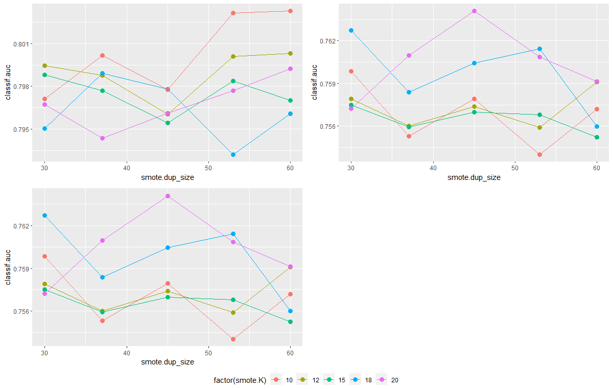
```

We can see from the three plots above, two plots is showing that *smote.dup_size* ranging from 37 to 53 together with *smote.k* from 15 to 20 tends to have better AUC values. So we would go with the corresponding parameter range with 37 to 53 for **smote.dup_size**, which will have the relatively high score with the prediction performance. However, we cannot decide the optimal range of parameter setting for **smote.k** since the changing trend for **K** is not so clear with different colors. Then we need to fix the *smote.dup_size* to 37 to 53 and reset the *smote.k* with 5 to 25, repeating the *grid_search* again to explore the two parameters further.

```{r}
# learner with fixed number of trees: 1000
rf_lrn <- lrn("classif.ranger", predict_type = "prob", num.trees = 1000)

# train with smote function's 2 parameters
param_smote <- ParamSet$new(params = list(
  ParamInt$new("smote.dup_size", lower = 37, upper = 53),
  ParamInt$new("smote.K", lower = 5, upper = 25)
))

# create smote learner fixed in rf_trees_fixed_lrn
rf_smote_lrn <- GraphLearner$new(po_smote %>>% rf_lrn, predict_type = "prob")
```

```{r echo=FALSE, eval=FALSE}
# create Autolearner for step 1
rf_auto_smote <- AutoTuner$new(
  learner = rf_smote_lrn, resampling = inner_rsmp,
  measures = msr("classif.auc"),
  tune_ps = param_smote,
  terminator = term("none"), tuner = tnr("grid_search", resolution = 5)
)

# design for smote
design_smote <- benchmark_grid(
  tasks = task,
  learners = rf_auto_smote,
  resampling = outer_rsmp
)

bmr_smote <- benchmark(design_smote, store_models = TRUE)

# plot smote parameters v.s. AUC
smote_path1 <- bmr_smote$data$learner[[1]]$archive("params")
rf_ggp1 <- ggplot(smote_path1, aes(
  x = smote.dup_size,
  y = classif.auc, col = factor(smote.K)
)) +
  geom_point(size = 3) +
  geom_line()

smote_path2 <- bmr_smote$data$learner[[2]]$archive("params")
rf_ggp2 <- ggplot(smote_path2, aes(
  x = smote.dup_size,
  y = classif.auc, col = factor(smote.K)
)) +
  geom_point(size = 3) +
  geom_line()

smote_path3 <- bmr_smote$data$learner[[3]]$archive("params")
rf_ggp3 <- ggplot(smote_path3, aes(
  x = smote.dup_size,
  y = classif.auc, col = factor(smote.K)
)) +
  geom_point(size = 3) +
  geom_line()

ggarrange(rf_ggp1, rf_ggp2, rf_ggp3, common.legend = TRUE, legend = "bottom")
```

```{r echo=FALSE,out.width = "100%", fig.pos="h"}
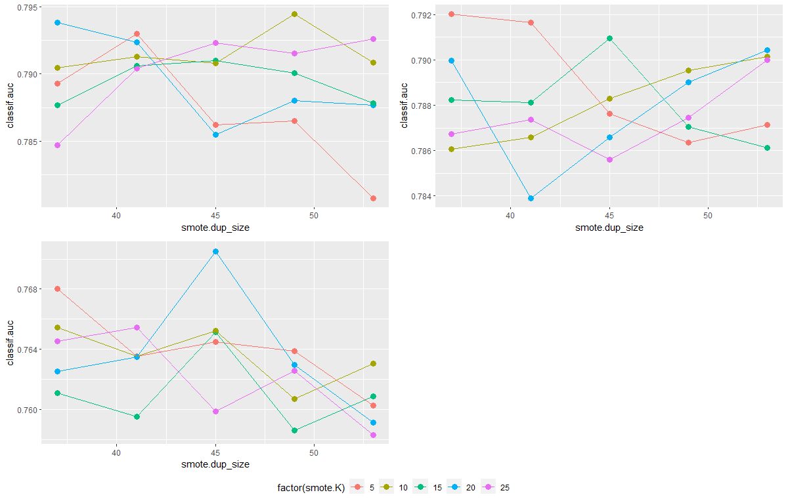
```

Shown on the plots above, we have discovered that the two parameters _smote.dup_size_ and _smote.k_ should be set to 45 and 15 seperately where the AUC distributions always tend to have a summit around _dup_size_ value 45 and _K_ with value 15 is much more stable with the prediction performance here at the same time. Then the next step we shall need to stay with the optimal smote parameter settings ( _smote.dup_size_ is set to 45 and _smote.k_ to 15) and take the mtry and the _num.trees_ parameters into consideration with parameters' tuning ranges set to 1-13 and 400-1700 as suggested by chapter 5.4 with the **tuneRanger** algorithm in order to get the best pair settings with the highest AUC value.


**Oversampling**

When it comes to use the oversampling method to address the imbalance distribution probelm occurred with the target variable _y_, we need to train the parameter _oversample.ratio_, which ranges from 1 to infinity, indicating the desired ratio between the majority example marked with 0 and the minority example marked with 1. In our case, the number of potential customers who got approved with the credit card is nearly 60 times the number of those who got rejected. Thus, when first try tuning for parameter _oversample.ratio_, we would set the corresponding parameter to a range starting from 30 to 60.

```{r}
# random forest learner
rf_learner <- lrn("classif.ranger", predict_type = "prob")

# set oversampling method
po_over <- po("classbalancing",
  id = "oversample", adjust = "minor",
  reference = "minor", shuffle = FALSE, ratio = 6
)

# create oversample fixed in learner
rf_over_learner <- GraphLearner$new(po_over %>>% rf_learner, predict_type = "prob")

# set oversampling parameter for rf
rf_over_param_set <- ParamSet$new(list(ParamDbl$new("oversample.ratio", lower = 30, upper = 60)))


# set inner_rsmp
inner_rsmp <- rsmp("cv", folds = 5L)

# create autotuner
rf_over_auto <- AutoTuner$new(
  learner = rf_over_learner, resampling = inner_rsmp,
  measures = msr("classif.auc"), tune_ps = rf_over_param_set,
  terminator = term("none"), tuner = tnr("grid_search", resolution = 12)
)

# set outer_resampling, and create a design with it
outer_rsmp <- rsmp("cv", folds = 3L)
rf_over_design <- benchmark_grid(
  tasks = task,
  learners = rf_over_auto,
  resamplings = outer_rsmp
)
```

With *store_models = TRUE* we allow the benchmark function to store each single model that was computed during tuning. Therefore, we can plot the tuning path of the best learner from the subsampling iterations:

```{r ,eval=FALSE,results='hide', message=FALSE, warning=FALSE}

rf_over_bmr <- run_benchmark(rf_over_design)

# aggregate to get results of model
rf_over_results <- rf_over_bmr$aggregate(measures = msr("classif.auc"))

# plot oversample.ratio v.s. AUC
over_path1 <- rf_over_bmr$data$learner[[1]]$archive("params")
over_gg1 <- ggplot(over_path1, aes(
  x = oversample.ratio,
  y = classif.auc
)) +
  geom_point(size = 3) +
  geom_line()

over_path2 <- rf_over_bmr$data$learner[[2]]$archive("params")
over_gg2 <- ggplot(over_path2, aes(
  x = oversample.ratio,
  y = classif.auc
)) +
  geom_point(size = 3) +
  geom_line()

over_path3 <- rf_over_bmr$data$learner[[3]]$archive("params")
over_gg3 <- ggplot(over_path3, aes(
  x = oversample.ratio,
  y = classif.auc
)) +
  geom_point(size = 3) +
  geom_line()

library(ggpubr)
ggarrange(over_gg1, over_gg2, over_gg3, common.legend = TRUE, legend = "bottom")
```

```{r echo=FALSE,out.width = "100%", fig.pos="h"}
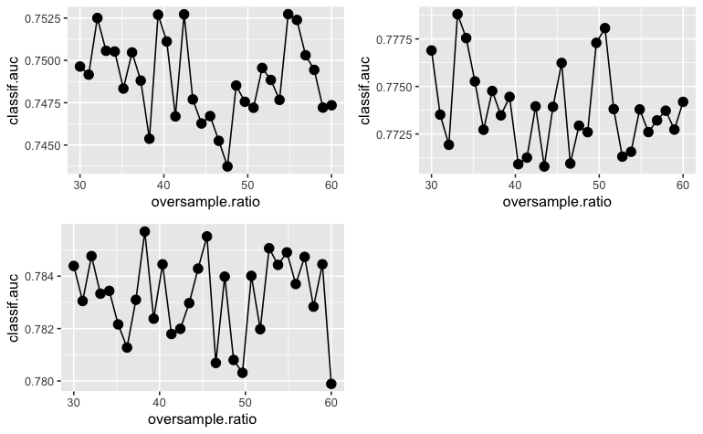
```

We can clearly see from all the three plots above, the **oversampling** method is not showing a stable changing trend with the corresponding _oversample.ratio_. The overall prediction performances given by the AUC value of the three figures is quite fluctuated and there are no fixed parameter range to choose with the best prediction score. Therefore, it is not suitable to use the **oversampling** method to resolve the imbalanced variables _y_. 

Thence, we will focus on using the already tuned parameter settings for the **SMOTE** function to  undergo the further model tuning procedures with different parameters _num.trees_, _mtry_, _min.node.size_ and _sample.fraction_ for random forest. The following is the detailed model tuning process. 

### Model tuning

```{r}
# RF with 4 different paramSets, to analysis how to do further tuning
# tuning for best num.trees and mtry pairs
rf_lrn <- lrn("classif.ranger", predict_type = "prob")

# train with ranger function's 2 parameters
param_nt_mtry <- ParamSet$new(params = list(
  ParamInt$new("classif.ranger.num.trees", lower = 400, upper = 1700),
  ParamInt$new("classif.ranger.mtry", lower = 1, upper = 13)
))

po_smote <- po("smote", dup_size = 45, K = 15)

# create smote learner fixed in rf_lrn
rf_smote_lrn <- GraphLearner$new(po_smote %>>% rf_lrn, predict_type = "prob")
```

```{r eval=FALSE,echo=FALSE}
# create Autolearner for rf_learner
rf_auto_smote <- AutoTuner$new(
  learner = rf_smote_lrn, resampling = inner_rsmp,
  measures = msr("classif.auc"), tune_ps = param_nt_mtry,
  terminator = term("none"), tuner = tnr("grid_search", resolution = 5)
)

# design for smote
design_smote <- benchmark_grid(
  tasks = task,
  learners = rf_auto_smote,
  resampling = outer_rsmp
)

# run benchmark
run_benchmark <- function(design) {
  set.seed(2020)
  tic()
  bmr <- benchmark(design, store_models = TRUE)
  toc()
  run_benchmark <- bmr
}

bmr_smote <- benchmark(design_smote, store_models = TRUE)

# plot ranger.num.tree v.s. AUC
nt_mtry_path1 <- bmr_smote$data$learner[[1]]$archive("params")
rf_ggp1 <- ggplot(nt_mtry_path1, aes(
  x = classif.ranger.num.trees,
  y = classif.auc, col = factor(classif.ranger.mtry)
)) +
  geom_point(size = 3) +
  geom_line()

nt_mtry_path2 <- bmr_smote$data$learner[[2]]$archive("params")
rf_ggp2 <- ggplot(nt_mtry_path2, aes(
  x = classif.ranger.num.trees,
  y = classif.auc, col = factor(classif.ranger.mtry)
)) + 
  geom_point(size = 3) +
  geom_line()

nt_mtry_path3 <- bmr_smote$data$learner[[3]]$archive("params")
rf_ggp3 <- ggplot(nt_mtry_path3, aes(
  x = classif.ranger.num.trees,
  y = classif.auc, col = factor(classif.ranger.mtry)
)) + 
  geom_point(size = 3) +
  geom_line() 

ggarrange(rf_ggp1, rf_ggp2, rf_ggp3, common.legend = TRUE, legend = "bottom")
```

```{r echo=FALSE,out.width = "100%", fig.pos="h"}
knitr::include_graphics("img/rf_smote_3.png")
```

So, we would go with the combination of _num.trees_ = 1000 and _mtry_ = 7. And the next step would be to tune _min.node.size_ and _sample.fraction_ with the previous selected parameters settings. According to **tuneRanger** algorithm, we shall try setting tuning range for _min.node.size_ from 2 to 8 and _sample.fraction_ from 0.5 to 0.8 and see the corresponding AUC performance.


```{r}
# RF with 4 different paramSets, to analysis how to do further tuning
# tuning for best min.node.size and sample.fraction pairs
rf_lrn <- lrn("classif.ranger", predict_type = "prob", num.trees = 1000, mtry = 7)

# train with smote function's 2 parameters
param_mns_sf <- ParamSet$new(params = list(
  ParamInt$new("classif.ranger.min.node.size", lower = 2, upper = 8),
  ParamDbl$new("classif.ranger.sample.fraction", lower = 0.5, upper = 0.8)
))

po_smote <- po("smote", dup_size = 45, K = 15)

# create smote learner fixed in rf_lrn
rf_smote_lrn <- GraphLearner$new(po_smote %>>% rf_lrn, predict_type = "prob")
```

```{r eval=FALSE,echo=FALSE}
# create Autolearner for rf_learner
rf_auto_smote <- AutoTuner$new(
  learner = rf_smote_lrn, resampling = inner_rsmp,
  measures = msr("classif.auc"), tune_ps = param_mns_sf,
  terminator = term("none"), tuner = tnr("grid_search", resolution = 5)
)

# outer resampling set
outer_rsmp <- rsmp("cv", folds = 3L)

# design for smote
design_smote <- benchmark_grid(
  tasks = task,
  learners = rf_auto_smote,
  resampling = outer_rsmp
)

bmr_smote <- run_benchmark(design_smote)

# plot ranger.sample.fraction v.s. AUC (with ranger.min.node.siz colored)
mns_sf_path1 <- bmr_smote$data$learner[[1]]$archive("params")
rf_ggp1 <- ggplot(mns_sf_path1, aes(
  x = classif.ranger.sample.fraction,
  y = classif.auc, col = factor(classif.ranger.min.node.size)
)) +
  geom_point(size = 3) +
  geom_line()

mns_sf_path2 <- bmr_smote$data$learner[[1]]$archive("params")
rf_ggp2 <- ggplot(mns_sf_path2, aes(
  x = classif.ranger.sample.fraction,
  y = classif.auc, col = factor(classif.ranger.min.node.size)
)) + 
  geom_point(size = 3) +
  geom_line()

mns_sf_path3 <- bmr_smote$data$learner[[1]]$archive("params")
rf_ggp3 <- ggplot(mns_sf_path3, aes(
  x = classif.ranger.sample.fraction,
  y = classif.auc, col = factor(classif.ranger.min.node.size)
)) +
  geom_point(size = 3) +
  geom_line()

ggarrange(rf_ggp1, rf_ggp2, rf_ggp3, common.legend = TRUE, legend = "bottom")
```

```{r echo=FALSE,out.width = "100%", fig.pos="h"}
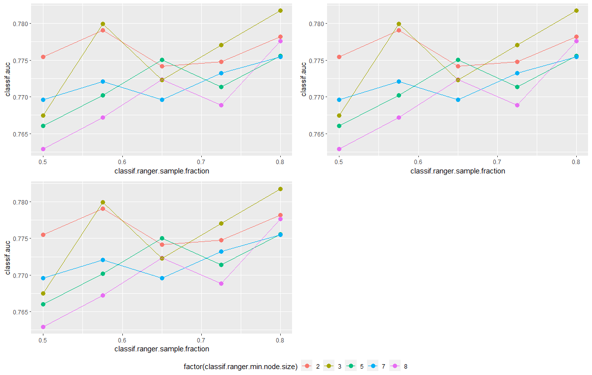
```

We would go with *min.node.size* = 3 as we can see the AUC value tends to reach the best performance when we set it to 3. However, it is still not clear the approximated defined range for parameter *sample.fraction* Next, we need to retrain the model with a wider range with parameter *sample.fraction* from 0.45 to 0.95.

```{r}
# RF with 4 different paramSets, to analysis how to do further tuning
## tuning for best sample.fraction
rf_lrn <- lrn("classif.ranger",
  predict_type = "prob", num.trees = 1000,
  mtry = 7, min.node.size = 3
)

# train with smote function's 2 parameters
param_sf <- ParamSet$new(params = list(ParamDbl$new("classif.ranger.sample.fraction",
  lower = 0.45, upper = 0.95
)))

# inner resampling set
inner_rsmp <- rsmp("cv", folds = 3)
po_smote <- po("smote", dup_size = 45, K = 15)

# create smote learner fixed in rf_lrn
rf_smote_lrn <- GraphLearner$new(po_smote %>>% rf_lrn, predict_type = "prob")
```

```{r eval=FALSE,echo=FALSE}
# create Autolearner for rf_learner
rf_auto_smote <- AutoTuner$new(
  learner = rf_smote_lrn, resampling = inner_rsmp,
  measures = msr("classif.auc"), tune_ps = param_sf,
  terminator = term("none"), tuner = tnr("grid_search", resolution = 5)
)

# design for smote
design_smote <- benchmark_grid(
  tasks = task,
  learners = rf_auto_smote,
  resampling = outer_rsmp
)

bmr_smote <- run_benchmark(design_smote)
bmr_result <- bmr_smote$aggregate(msr("classif.auc"))

# plot ranger.sample.fraction v.s. AUC
mns_sf_path1 <- bmr_smote$data$learner[[1]]$archive("params")
rf_ggp1 <- ggplot(mns_sf_path1, aes(
  x = classif.ranger.sample.fraction,
  y = classif.auc
)) +
  geom_point(size = 3) +
  geom_line()

mns_sf_path2 <- bmr_smote$data$learner[[1]]$archive("params")
rf_ggp2 <- ggplot(mns_sf_path2, aes(
  x = classif.ranger.sample.fraction,
  y = classif.auc
)) +
  geom_point(size = 3) +
  geom_line()

mns_sf_path3 <- bmr_smote$data$learner[[1]]$archive("params")
rf_ggp3 <- ggplot(mns_sf_path3, aes(
  x = classif.ranger.sample.fraction,
  y = classif.auc
)) +
  geom_point(size = 3) +
  geom_line()

ggarrange(rf_ggp1, rf_ggp2, rf_ggp3, common.legend = TRUE, legend = "bottom")

```

```{r echo=FALSE,out.width = "100%", fig.pos="h"}
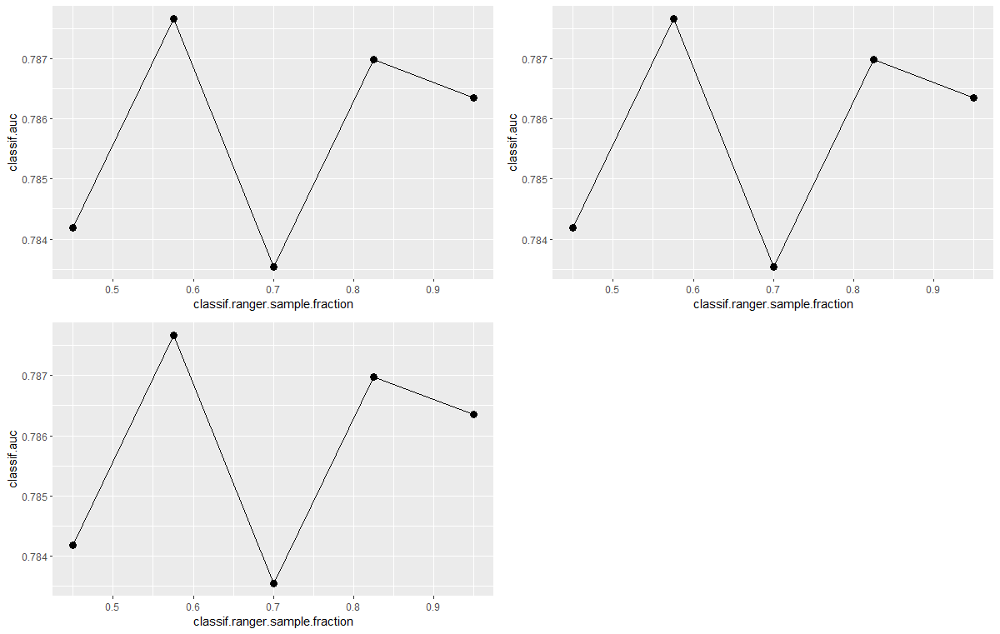
```

When reaching the highest AUC value, *sample.fraction* is always taking good performance values around 0.55 and 0.6 and the distributions of *min.node.size* are showing better performance results (measured by AUC) with value 3. Therefore, we would choose the *sample.fraction* with 0.575 and have a better AUC performance value with 0.83.

After the step-by-step hyperparameter tuning, we have finally managed to reach our best prediction performance with AUC value fixed at 0.83 which shows the improvement of 0.07 in comparison with the performance of Random Forest's default model with value 0.76. In conclusion, when *smote.dup_size* being set to 45 and *smote.K* to 15 with the SMOTE operator, the final parameter settings combination would be *num.trees* = 1000, *mtry* = 7, *min.node.size* = 3 and *sample.fraction* = 0.575, reaching an AUC level at 0.83.


\newpage

# Conclusion and Discussion
## Conclusion
In general, we have implemented four different training models (Logistic Regression, KNN, SVM and Random Forest) on the same training task (dl_iv_data). Besides the basic training process with default parameter settings with different models, we have also discovered the necessary methods (SMOTE algorithm and Oversampling Operator) to tackle with the imbalanced target data distribution and tune the models with corresponding parameters afterwards. By plotting the changing trend of different parameters separately, we shall be able to determine the best parameter setting combinations and achieve the highest AUC score with the ultimate chosen model. After determining for the related parameters which are used for data balancing and finishing the model tuning procedures with parameters accordingly, we have run into the  conclusion that Random Forest has shown a considerably better prediction performance, with an average of 10% improvement among all other training models, in regard to the decision on whether or not to issue the credit card to the potential customer. As for our mission to predict the ultimate decision concerning credit card approval, we would definitely choose Random Forest algorithm and implement the prediction afterwards with various customers.

## Discussion
Based on our previous work, there are still many aspects can be improved in our article. First of all, more powerful models that we can use to solve some problems that we met. For example, it's computationally expensive to train the SVM model, a 3*3 nested resampling of SVM model takes 5 hours. Secondly, we have tried xgboost and we found it extremly fast to excute but with the worst prediction performance of all (AUC=0.5 and not improved after any kinds of model tuning).
On the other hand, there are still a lot of cutting-edge models we haven't used,
e.g. lightGBM(not included in mlr3 yet), Deep learning method(require high computational power).
Last but not least, there are still areas to explore in our feature engineering procedure. For example, dimension reduction methods such as PCA, MDS and Factor analysis (included in mlr3 filters) can also be used.